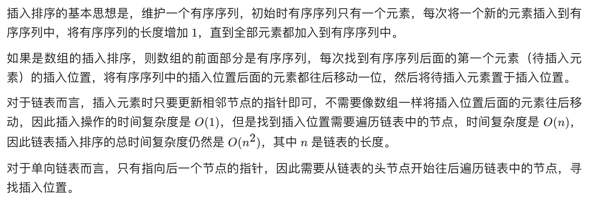
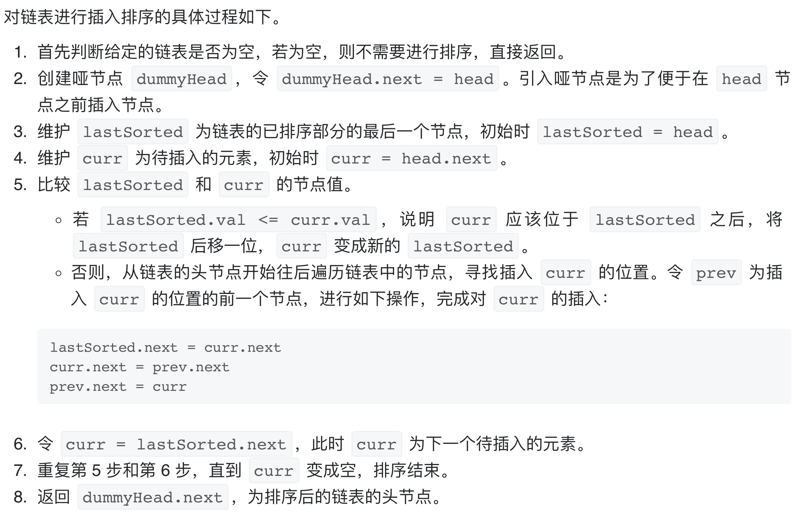

# [147. 对链表进行插入排序](https://leetcode-cn.com/problems/insertion-sort-list/)

## 解题思路





## 复杂度分析

**时间复杂度：O(N^2)**

**空间复杂度：O(1)** 

## 代码实现

```golang
func insertionSortList(head *ListNode) *ListNode {
	if head == nil {
		return nil
	}
	dummyHead := &ListNode{Next: head} // 哨兵节点
	lastSorted, curr := head, head.Next
	for curr != nil {
		if lastSorted.Val <= curr.Val { // 已排序序列的最大值小于当前值，说明顺序正常
			lastSorted = lastSorted.Next // 后移指针
		} else {
			prev := dummyHead
			for prev.Next.Val <= curr.Val {
				// 从头节点->当前节点 查找插入的位置
				// 注意此处不能从head开始找，因为此时head可能已被换到中间位置
				// dummyHead.Next才是第一个节点，而非head
				prev = prev.Next
			}
			// 插入到对应位置
			lastSorted.Next = curr.Next
			curr.Next = prev.Next
			prev.Next = curr
		}
		curr = lastSorted.Next
	}
	return dummyHead.Next
}
```

## 相关题目

[148. 排序链表](https://github.com/WTongStudio/LeetCode/blob/master/数据结构/链表/148.%20排序链表.md)