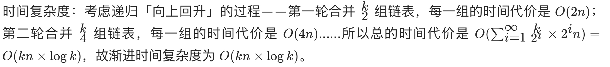

# [23. 合并K个升序链表](https://leetcode-cn.com/problems/merge-k-sorted-lists/)

## 方法一：归并合并

## 解题思路

本题是 [剑指 Offer 25. 合并两个排序的链表](https://github.com/WTongStudio/LeetCode/blob/master/数据结构/链表/剑指%20Offer%2025.%20合并两个排序的链表.md) 的扩展，可以基于合并两个有序链表的方法来递归实现，将数组中的链表两两合并。

## 复杂度分析

**时间复杂度：O(NKlogK)**



**空间复杂度：O(logK)** 

## 代码实现

```golang
func mergeTwoLists(l1 *ListNode, l2 *ListNode) *ListNode { // 合并两个有序链表
	dummyHead := &ListNode{} // 哨兵节点优化，简化操作
	prev := dummyHead
	node1, node2 := l1, l2
	for node1 != nil && node2 != nil {
		if node1.Val <= node2.Val {
			prev.Next = node1
			prev = node1
			node1 = node1.Next
		} else {
			prev.Next = node2
			prev = node2
			node2 = node2.Next
		}
	}
	// 注意处理结尾
	if node1 != nil {
		prev.Next = node1
	}
	if node2 != nil {
		prev.Next = node2
	}
	return dummyHead.Next
}

func merge(lists []*ListNode, left, right int) *ListNode { // 归并合并数组中的链表
	if left == right {
		return lists[left]
	}
	if left > right { // 终止条件
		return nil
	}
	mid := left + (right-left)>>1
	return mergeTwoLists(merge(lists, left, mid), merge(lists, mid+1, right))
}

func mergeKLists(lists []*ListNode) *ListNode {
	return merge(lists, 0, len(lists)-1)
}
```

## 方法二：优先队列（推荐）

## 解题思路

基于优先队列实现，将数组中所有链表的头节点入队，然后不断的从优先队列中获取元素，将其加入到合并后的链表中，并将出队链表的下一个元素入队。

## 复杂度分析

**时间复杂度：O(NKlogK)**

**空间复杂度：O(K)** 

## 代码实现

```golang
type Heap []*ListNode

func (h Heap) Len() int {
	return len(h)
}
func (h Heap) Swap(i, j int) {
	h[i], h[j] = h[j], h[i]
}

func (h Heap) Less(i, j int) bool {
	return h[i].Val < h[j].Val
}

func (h *Heap) Push(value interface{}) {
	*h = append(*h, value.(*ListNode))
}

func (h *Heap) Pop() interface{} {
	value := (*h)[len(*h)-1]
	*h = (*h)[:len(*h)-1]
	return value
}

func mergeKLists(lists []*ListNode) *ListNode {
	priorityQueue := &Heap{} // 用小顶堆实现优先队列
	heap.Init(priorityQueue)
	for i := 0; i < len(lists); i++ { // 所有链表的头指针入队
		if lists[i] != nil {
			heap.Push(priorityQueue, lists[i])
		}
	}
	dummyHead := &ListNode{}
	prev := dummyHead
	for priorityQueue.Len() > 0 {
		node := heap.Pop(priorityQueue).(*ListNode)
		if node.Next != nil {
			heap.Push(priorityQueue, node.Next)
		}
		prev.Next = node
		prev = node
	}
	return dummyHead.Next
}
```

## 相关题目

[剑指 Offer 25. 合并两个排序的链表](https://github.com/WTongStudio/LeetCode/blob/master/数据结构/链表/剑指%20Offer%2025.%20合并两个排序的链表.md)
