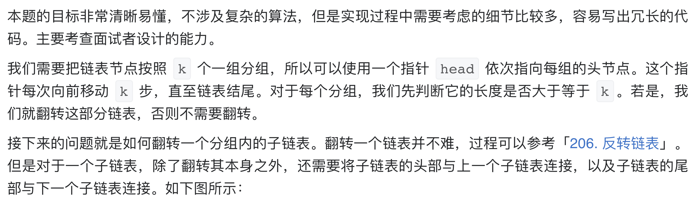
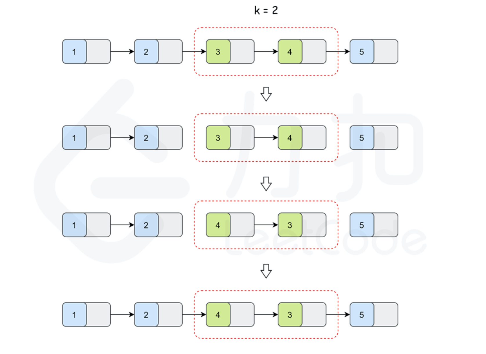
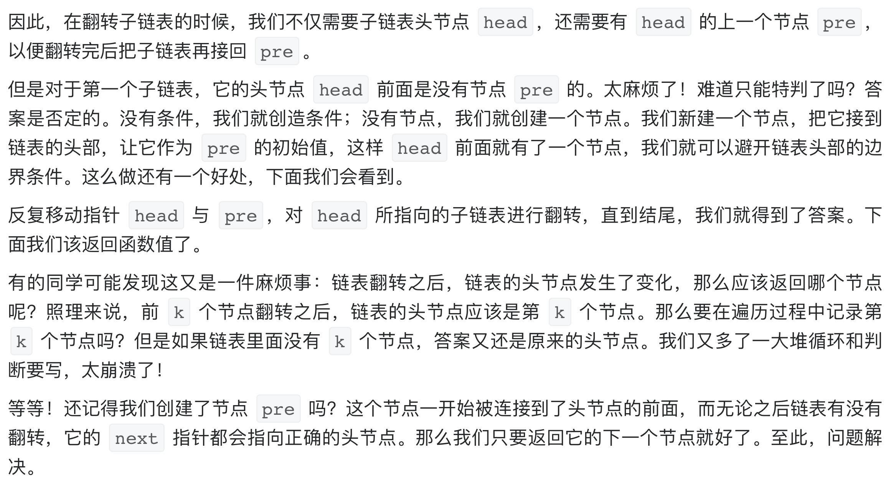

# [25. K 个一组翻转链表](https://leetcode-cn.com/problems/reverse-nodes-in-k-group/)

## 解题思路







## 复杂度分析

**时间复杂度：O(N)**

**空间复杂度：O(1)** 

## 代码实现

```golang
func reverseKGroup(head *ListNode, k int) *ListNode {
	dummyHead := &ListNode{Next: head} // 哨兵节点
	prev := dummyHead
	curr := head
	for curr != nil {
		tail := prev
		for i := 0; i < k; i++ {
			tail = tail.Next
			if tail == nil { // 说明最后一组不足k个
				return dummyHead.Next
			}
		}
		next := tail.Next             // 记录之后的节点
		tail.Next = nil               // 断开链接
		prev.Next = reverseList(curr) // 翻转链表
		curr.Next = next              // 此时的curr由原本的头节点变为尾节点
		prev = curr                   // 更新前驱节点
		curr = next                   // 更新当前节点
	}
	return dummyHead.Next
}

func reverseList(head *ListNode) *ListNode { // 翻转链表
	var prev *ListNode
	curr := head
	for curr != nil {
		next := curr.Next
		curr.Next = prev
		prev = curr
		curr = next
	}
	return prev
}
```