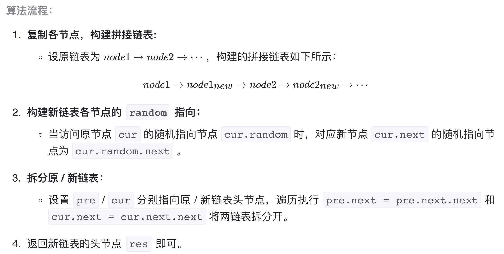

# [剑指 Offer 35. 复杂链表的复制](https://leetcode-cn.com/problems/fu-za-lian-biao-de-fu-zhi-lcof/)

## 解题思路

**本题难点：** 在复制链表的过程中构建新链表各节点的 random 引用指向，注意 random 有可能为 nil。

本题可以采用哈希表记录所有 random 的指向节点，需要额外申请空间，不是最优解。

**考虑构建 原节点 1 -> 新节点 1 -> 原节点 2 -> 新节点 2 -> …… 的拼接链表，如此便可在访问原节点的 random 指向节点的同时找到新对应新节点的 random 指向节点**。



**特别注意，最后需要恢复原链表，否则会报错！**

## 复杂度分析

**时间复杂度：O(N)**， 三轮遍历链表，使用 O(N) 时间。

**空间复杂度：O(1)** ，除了返回结果链表以外，节点引用变量使用常数大小的额外空间。

## 代码实现

```golang
type Node struct {
	Val    int
	Next   *Node
	Random *Node
}

func copyRandomList(head *Node) *Node {
	if head == nil { // 特判
		return nil
	}
	// 1、交替串联链表
	for curr := head; curr != nil; {
		newNode := &Node{Val: curr.Val, Next: curr.Next}
		curr.Next = newNode
		curr = newNode.Next
	}
	// 2、随机指针复制
	for curr := head; curr != nil; {
		if curr.Random != nil {
			curr.Next.Random = curr.Random.Next
		}
		curr = curr.Next.Next
	}
	// 3、拆分链表
	preHead := &Node{}
	prev := preHead
	for curr := head; curr != nil; {
		prev.Next = curr.Next
		prev = curr.Next
		curr.Next = curr.Next.Next // 恢复原始链表，否则会报错
		curr = curr.Next
	}
	return preHead.Next
}
```