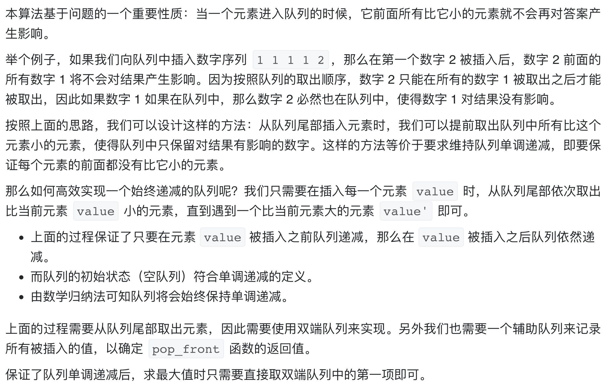

# [剑指 Offer 59 - II. 队列的最大值](https://leetcode-cn.com/problems/dui-lie-de-zui-da-zhi-lcof/)

## 解题思路



## 复杂度分析

**时间复杂度：O(1)**

**空间复杂度：O(N)** 

## 代码实现

```golang
type MaxQueue struct {
	queue *list.List // 链表模拟队列
	deque *list.List // 链表模拟双向队列
}

func Constructor() MaxQueue {
	return MaxQueue{list.New(), list.New()}
}

func (this *MaxQueue) Max_value() int {
	if this.deque.Len() == 0 {
		return -1
	}
	return this.deque.Front().Value.(int)
}

func (this *MaxQueue) Push_back(value int) {
	this.queue.PushBack(value)
	for this.deque.Len() > 0 && this.deque.Back().Value.(int) < value {
		this.deque.Remove(this.deque.Back())
	}
	this.deque.PushBack(value)
}

func (this *MaxQueue) Pop_front() int {
	if this.queue.Len() == 0 {
		return -1
	}
	front := this.queue.Remove(this.queue.Front()).(int)
	if this.deque.Front().Value.(int) == front { // 出队元素与双向队列中的队首元素相等
		this.deque.Remove(this.deque.Front())
	}
	return front
}
```