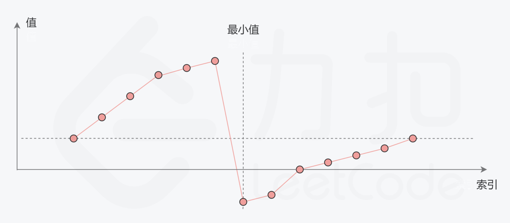
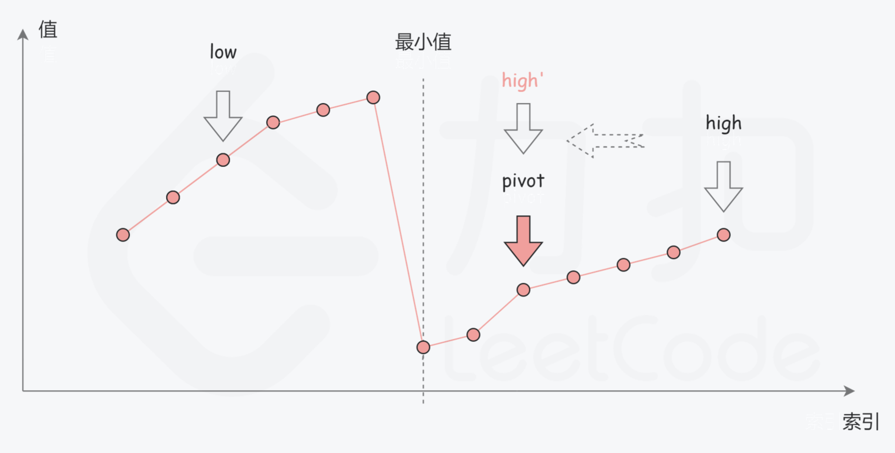
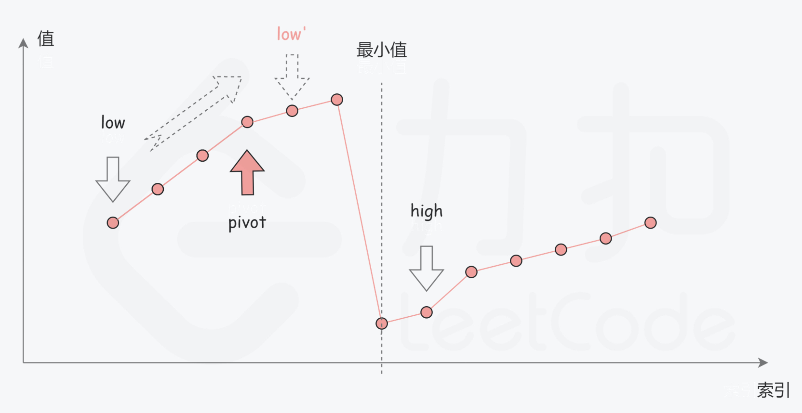

# [153. 寻找旋转排序数组中的最小值](https://leetcode-cn.com/problems/find-minimum-in-rotated-sorted-array/)

## 解题思路

一个**不包含重复元素**的**升序数组**在经过旋转之后，可以得到下面可视化的折线图：



**考虑数组中的最后一个元素 x**：在最小值右侧的元素（不包括最后一个元素本身），它们的值一定都**严格小于** x；而在最小值左侧的元素，它们的值一定都**严格大于** x。因此，我们可以根据这一条性质，通过二分查找的方法找出最小值。

在二分查找的每一步中，左边界为 low，右边界为 high，区间的中点为 pivot，最小值就在该区间内。我们将中轴元素 nums[pivot] 与右边界元素 nums[high] 进行比较，可能会有以下的三种情况：

**第一种情况： nums[pivot] < nums[high]**，说明 nums[pivot] 是最小值右侧的元素，因此可以忽略二分查找区间的右半部分；



**第二种情况：nums[pivot] > nums[high]**，说明 nums[pivot] 是最小值左侧的元素，因此可以忽略二分查找区间的左半部分；



**第三种情况：nums[pivot] = nums[high]**，由于数组不包含重复元素，并且只要当前的区间长度不为 1， pivot 就不会与 high 重合；而如果当前的区间长度为 1，说明已经可以结束二分查找了。因此不会存在 nums[pivot]=nums[high] 的情况。

## 复杂度分析

**时间复杂度：O(logN)**

**空间复杂度：O(1)** 

## 代码实现

```golang
func findMin(nums []int) int {
	low, high := 0, len(nums)-1
	for low < high {
		pivot := low + (high-low)>>1  // 防止类型溢出
		if nums[pivot] < nums[high] { // 说明pivot在最小值的右侧，或它就是最小值
			high = pivot // 缩小区间
		}
		if nums[pivot] > nums[high] { // 说明pivot在最小值的左侧，且它不可能是最小值
			low = pivot + 1 // 缩小区间，注意细节
		}
	}
	return nums[low]
}
```

## 相关问题

[154. 寻找旋转排序数组中的最小值 II](https://github.com/WTongStudio/LeetCode/blob/master/算法/二分法/154.%20寻找旋转排序数组中的最小值%20II.md)

