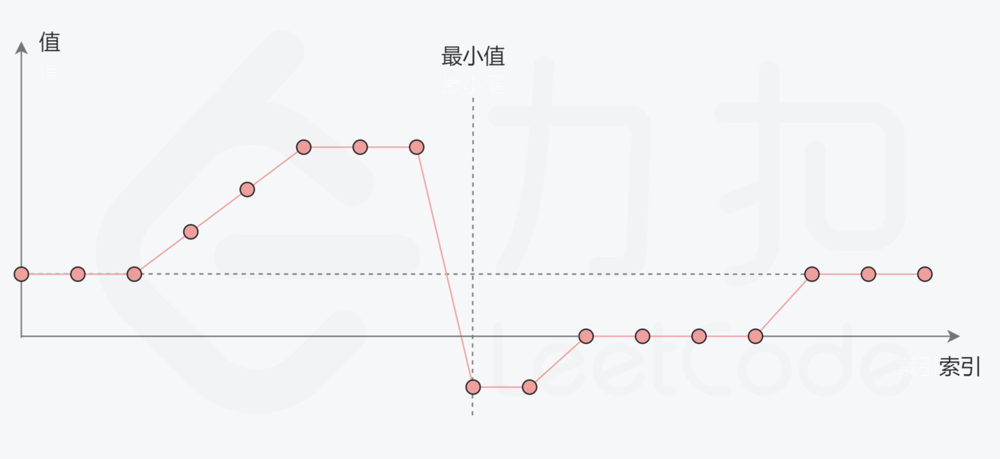

# [154. 寻找旋转排序数组中的最小值 II](https://leetcode-cn.com/problems/find-minimum-in-rotated-sorted-array-ii/)

## 解题思路

一个**包含重复元素**的**升序数组**在经过旋转之后，可以得到下面可视化的折线图：



**考虑数组中的最后一个元素 x**：在最小值右侧的元素，它们的值一定都**小于等于** x；而在最小值左侧的元素，它们的值一定都**大于等于** x。因此，我们可以根据这一条性质，通过二分查找的方法找出最小值。

在二分查找的每一步中，左边界为 low，右边界为 high，区间的中点为 pivot，最小值就在该区间内。我们将中轴元素 nums[pivot] 与右边界元素 nums[high] 进行比较，可能会有以下的三种情况：

**第一种情况： nums[pivot] < nums[high]**，说明 nums[pivot] 是最小值右侧的元素，因此可以忽略二分查找区间的右半部分；


**第二种情况：nums[pivot] > nums[high]**，说明 nums[pivot] 是最小值左侧的元素，因此可以忽略二分查找区间的左半部分；


**第三种情况：nums[pivot] = nums[high]**，，由于重复元素的存在，并不能确定 nums[pivot] 究竟在最小值的左侧还是右侧，因此不能莽撞地忽略某一部分的元素。**我们唯一可以确定的是，由于它们的值相同，所以无论 nums[high] 是不是最小值，都有一个它的「替代品」**
**nums[pivot]，因此我们可以忽略二分查找区间的右端点**。


## 复杂度分析

**时间复杂度：O(logN)**

**空间复杂度：O(1)** 

## 代码实现

```golang
func findMin(nums []int) int {
	low, high := 0, len(nums)-1
	for low < high {
		pivot := low + (high-low)>>1  // 防止类型溢出
		if nums[pivot] < nums[high] { // 说明pivot在最小值的右侧，或它就是最小值
			high = pivot // 缩小区间
		} else if nums[pivot] > nums[high] { // 说明pivot在最小值的左侧，且它不可能是最小值
			low = pivot + 1 // 缩小区间，注意细节
		} else { // nums[pivot] == nums[high]时，无法确定pivot与最小值位置，忽略nums[high]，继续查找
			high--
		}

	}
	return nums[low]
}
```

## 相关问题

[153. 寻找旋转排序数组中的最小值](https://leetcode-cn.com/problems/find-minimum-in-rotated-sorted-array/)

[剑指 Offer 11. 旋转数组的最小数字](https://leetcode-cn.com/problems/xuan-zhuan-shu-zu-de-zui-xiao-shu-zi-lcof/)

