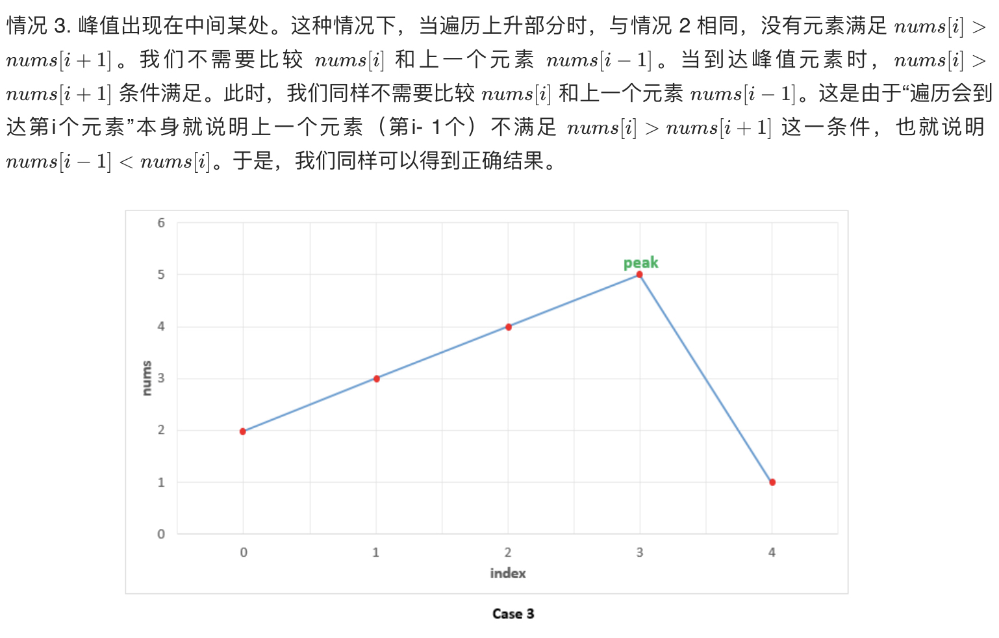

# [162. 寻找峰值](https://leetcode-cn.com/problems/find-peak-element/)

## 方法一：线性扫描

## 解题思路




## 复杂度分析

**时间复杂度：O(N)**

**空间复杂度：O(1)** 

## 代码实现

```golang
func findPeakElement(nums []int) int {
	n := len(nums)
	for i := 0; i < n-1; i++ {
		if nums[i] > nums[i+1] {
			return i
		}
	}
	return n - 1
}
```


## 方法二：二分法

## 解题思路


## 复杂度分析

**时间复杂度：O(logN)**

**空间复杂度：O(1)** 

## 代码实现

```go
func findPeakElement(nums []int) int {
	low, high := 0, len(nums)-1
	for low < high { // 注意边界不能相等，否则会死循环
		mid := low + (high-low)>>1
		if nums[mid] > nums[mid+1] {
			high = mid
		} else {
			low = mid + 1
		}
	}
	return low
}
```

