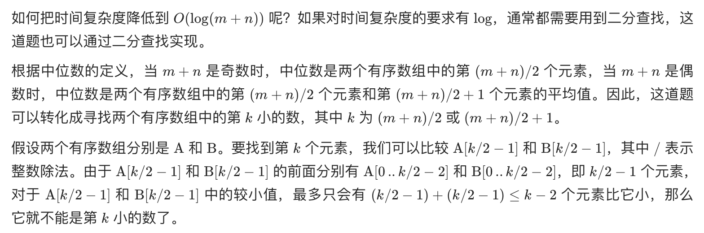
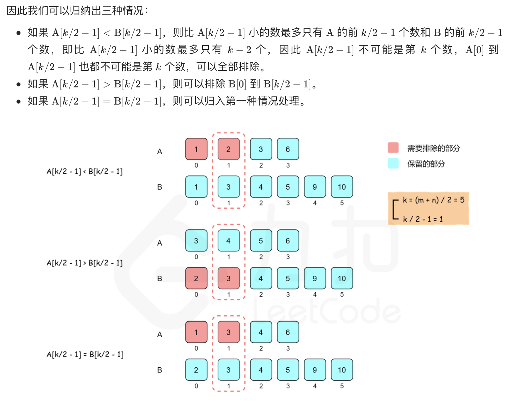
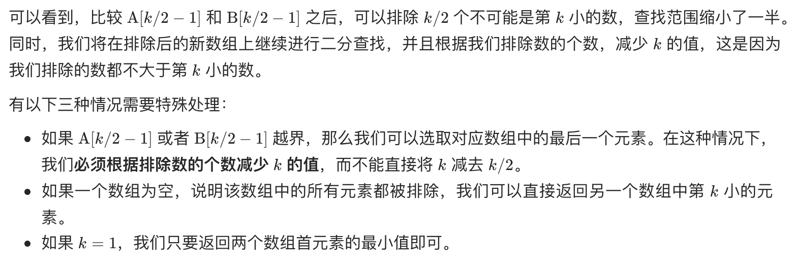

# [4. 寻找两个正序数组的中位数](https://leetcode-cn.com/problems/median-of-two-sorted-arrays/)

## 方法一：二分法（推荐，再理解，背下来）

## 解题思路

注意本题与 [剑指 Offer 41. 数据流中的中位数](https://github.com/WTongStudio/LeetCode/blob/master/数据结构/堆/剑指%20Offer%2041.%20数据流中的中位数.md) 的细微区别，首先**两个数组是有序的**，并且**数组与数据流是不同的**，数组的长度在传入方法时已经固定，而数据流长度是不固定的。因此本题采用两个堆查找数据流中位数的方法虽然可以解题，但**不是最优解**！有序数组首先考虑使用二分法！

给定两个有序数组，要求找到两个有序数组的中位数，最直观的思路有以下两种：

1. 使用归并的方式，合并两个有序数组，得到一个大的有序数组。大的有序数组的中间位置的元素，即为中位数。
2. 不需要合并两个有序数组，只要找到中位数的位置即可。由于两个数组的长度已知，因此中位数对应的两个数组的下标之和也是已知的。维护两个指针，初始时分别指向两个数组的下标 0 的位置，每次将指向较小值的指针后移一位（如果一个指针已经到达数组末尾，则只需要移动另一个数组的指针），直到到达中位数的位置。

假设两个有序数组的长度分别为 m 和 n，上述两种思路的复杂度如何？

第一种思路的时间复杂度是 O(m+n)，空间复杂度是 O(m+n)。第二种思路虽然可以将空间复杂度降到 O(1)，但是时间复杂度仍是 O(m+n)。







## 复杂度分析

**时间复杂度：O(log(N+M))**

**空间复杂度：O(1)** 

## 代码实现

```golang
func findMedianSortedArrays(nums1 []int, nums2 []int) float64 {
	totalLength := len(nums1) + len(nums2)
	if totalLength%2 == 1 { // 合并后长度为奇数
		midIndex := totalLength / 2
		return float64(getKthElement(nums1, nums2, midIndex+1))
	} else { // 合并后长度为偶数，返回中间两数的平均值
		midIndex1, midIndex2 := totalLength/2-1, totalLength/2
		return float64(getKthElement(nums1, nums2, midIndex1+1)+getKthElement(nums1, nums2, midIndex2+1)) / 2.0
	}
}
func getKthElement(nums1, nums2 []int, k int) int { // 查找两个有序数组中第 k 大的元素
	// 主要思路：要找到第 k (k>1) 小的元素，那么就取 pivot1 = nums1[k/2-1] 和 pivot2 = nums2[k/2-1] 进行比较
	// nums1 中小于等于 pivot1 的元素有 nums1[0 .. k/2-2] 共计 k/2-1 个
	// nums2 中小于等于 pivot2 的元素有 nums2[0 .. k/2-2] 共计 k/2-1 个
	// 取 pivot = min(pivot1, pivot2)，两个数组中小于等于 pivot 的元素共计不会超过 (k/2-1) + (k/2-1) <= k-2 个
	// 这样 pivot 本身最大也只能是第 k-1 小的元素
	// 如果 pivot = pivot1，那么 nums1[0 .. k/2-1] 都不可能是第 k 小的元素。把这些元素全部 "删除"，剩下的作为新的 nums1 数组
	// 如果 pivot = pivot2，那么 nums2[0 .. k/2-1] 都不可能是第 k 小的元素。把这些元素全部 "删除"，剩下的作为新的 nums2 数组
	// 由于我们 "删除" 了一些元素（这些元素都比第 k 小的元素要小），因此需要修改 k 的值，减去删除的数的个数
	index1, index2 := 0, 0
	n, m := len(nums1), len(nums2)
	for {
		if index1 == n { // 越界处理，相当于排除掉 nums1 中的所有元素
			return nums2[index2+k-1]
		}
		if index2 == m { // 越界处理，相当于排除掉 nums2 中的所有元素
			return nums1[index1+k-1]
		}
		if k == 1 { // 特判，返回最小值
			return min(nums1[index1], nums2[index2])
		}
		mid := k / 2
		newIndex1 := min(index1+mid, n) - 1 // 注意下标处理，相当于删掉了 0~index1 的元素
		newIndex2 := min(index2+mid, m) - 1 // 注意下标处理，相当于删掉了 0~index2 的元素
		pivot1, pivot2 := nums1[newIndex1], nums2[newIndex2]
		if pivot1 <= pivot2 {
			k -= newIndex1 - index1 + 1 // 排除元素
			index1 = newIndex1 + 1      // 更新搜索范围
		} else {
			k -= newIndex2 - index2 + 1 // 排除元素
			index2 = newIndex2 + 1      // 更新搜索范围
		}
	}
}
func min(x, y int) int {
	if x < y {
		return x
	}
	return y
}
```

## 方法二：两个堆

## 解题思路

解法与 [剑指 Offer 41. 数据流中的中位数](https://github.com/WTongStudio/LeetCode/blob/master/数据结构/堆/剑指%20Offer%2041.%20数据流中的中位数.md) 一样，使用两个堆实现。

## 复杂度分析

**时间复杂度：O(NlogN)**

**空间复杂度：O(1)** 

## 代码实现

```golang
type Heap []int

func (h Heap) Len() int { // 值接收者，处理方便
	return len(h)
}
func (h Heap) Swap(i, j int) { // 值接收者，处理方便
	h[i], h[j] = h[j], h[i]
}

func (h *Heap) Pop() interface{} { // 指针接收者，需要操作底层数组，若用值接收者则会拷贝一份底层数组操作
	v := (*h)[len(*h)-1]
	*h = (*h)[:len(*h)-1]
	return v
}

func (h *Heap) Push(v interface{}) { // 指针接收者，需要操作底层数组，若用值接收者则会拷贝一份底层数组操作
	*h = append(*h, v.(int))
}

type maxHeap struct { // 大顶堆
	Heap
}

func (m *maxHeap) Less(i, j int) bool { // 值接收者，处理方便
	return m.Heap[i] > m.Heap[j]
}

type minHeap struct { // 小顶堆
	Heap
}

func (m *minHeap) Less(i, j int) bool { // 值接收者，处理方便
	return m.Heap[i] < m.Heap[j]
}

type MedianFinder struct {
	LeftMax  *maxHeap // 前半部分数据构建大顶堆
	RightMin *minHeap // 后半部分数据构建小顶堆
}

/** initialize your data structure here. */
func Constructor() MedianFinder { // 工厂方法，返回对象值，不要返回指针，指针对象会逃逸到堆上
	m := new(MedianFinder)
	m.RightMin = new(minHeap)
	m.LeftMax = new(maxHeap)
	heap.Init(m.LeftMax)  // 注意初始化！利用 golang 的 heap 接口实现堆
	heap.Init(m.RightMin) // 注意初始化！利用 golang 的 heap 接口实现堆
	return *m
}

func (this *MedianFinder) AddNum(num int) {
	// 压入数据时有两种情况；
	// 1）原有数据为偶数个，则有 LeftMax.len() == RightMin.len()
	//   此时将数据放入 LeftMax
	//   高明之处：需先将数据放在 RightMin，再从 RightMin 中 pop 出一个元素，将其放入 LeftMax
	//   省去了判断 num 与 RightMin最小值 及 LeftMax最大值 的比较，通过比较判断 num 应该放在哪个 heap
	//   然后再根据左右 heap 的长度，对左右 heap 进行调整
	// 2) 原有数据为奇数个，则有 LeftMax.len() == RightMin.len() + 1
	//   此时将数据放入 RightMin
	//   类似上一步，需先将数据放在 LeftMax，再从 LeftMax 中 pop 出一个元素，将其放入 RightMin 中
	if this.LeftMax.Len() == this.RightMin.Len() {
		heap.Push(this.RightMin, num)
		heap.Push(this.LeftMax, heap.Pop(this.RightMin))
	} else {
		heap.Push(this.LeftMax, num)
		heap.Push(this.RightMin, heap.Pop(this.LeftMax))
	}
}

func (this *MedianFinder) FindMedian() float64 {
	if (this.RightMin.Len()+this.LeftMax.Len())%2 == 0 {
		// 取堆顶元素，直接从结构中取 Heap[0]，省去用 heap.Pop() 后再做类型断言了
		return float64(this.LeftMax.Heap[0]+this.RightMin.Heap[0]) / 2
	} else {
		// 取堆顶元素，直接从结构中取 Heap[0]，省去用 heap.Pop() 后再做类型断言了
		return float64(this.LeftMax.Heap[0])
	}
}

func findMedianSortedArrays(nums1 []int, nums2 []int) float64 {
	mf := Constructor()
	for _, num := range nums1 {
		mf.AddNum(num)
	}
	for _, num := range nums2 {
		mf.AddNum(num)
	}
	return mf.FindMedian()
}
```

## 相关题目

[剑指 Offer 41. 数据流中的中位数](https://github.com/WTongStudio/LeetCode/blob/master/数据结构/堆/剑指%20Offer%2041.%20数据流中的中位数.md)
