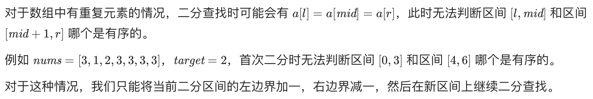

# [81. 搜索旋转排序数组 II](https://leetcode-cn.com/problems/search-in-rotated-sorted-array-ii/)

## 解题思路

解法参考题目 [33. 搜索旋转排序数组](https://github.com/WTongStudio/LeetCode/blob/master/算法/二分法/33.%20搜索旋转排序数组.md)，针对重复元素，可以直接跳过继续做二分查找。



## 复杂度分析

**时间复杂度：O(logN)**

**空间复杂度：O(1)** 

## 代码实现

```golang
func search(nums []int, target int) bool {
	n := len(nums)
	if n == 0 { // 特判
		return false
	}
	if n == 1 {
		if nums[0] == target { // 特判
			return true
		}
		return false
	}
	low, high := 0, n-1
	for low <= high {
		mid := low + (high-low)>>1
		if nums[mid] == target {
			return true
		}
		if nums[low] == nums[mid] && nums[mid] == nums[high] {
			// 若三值相等无法判断有序区间，只能左右边界缩减1，继续二分查找
			low++
			high--
		} else if nums[mid] >= nums[low] { // 若左区间有序，注意此处为>=，否则会报错，等于的情况必须包含在左区间
			if nums[low] <= target && target < nums[mid] {
				// 目标值在左区间范围内
				high = mid - 1
			} else {
				low = mid + 1
			}
		} else { // 若右区间有序
			if nums[mid] < target && target <= nums[high] {
				// 目标值在右区间范围内
				low = mid + 1
			} else {
				high = mid - 1
			}
		}
	}
	return false
}
```

## 相关题目

[33. 搜索旋转排序数组](https://github.com/WTongStudio/LeetCode/blob/master/算法/二分法/33.%20搜索旋转排序数组.md)