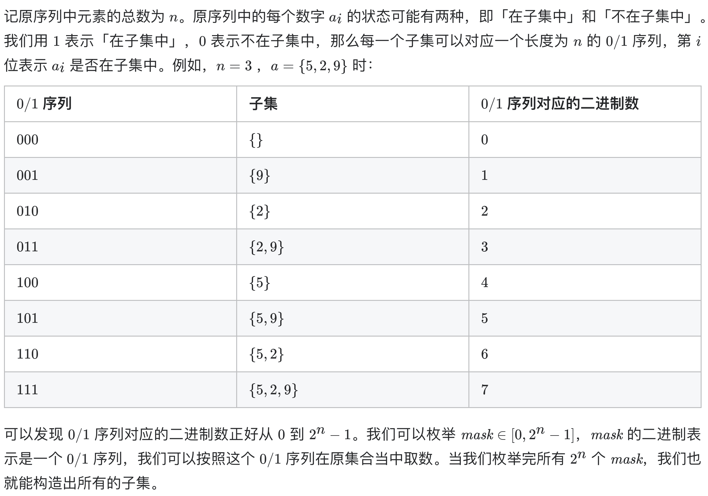

# [78. 子集](https://leetcode-cn.com/problems/subsets/)

## 方法一：位运算（推荐）

## 解题思路



## 复杂度分析

**时间复杂度：O(N*2^N)**，一共 2n 个状态，每种状态需要 O(n) 的时间来构造子集。

**空间复杂度：O(N)** 

## 代码实现

```golang
func subsets(nums []int) [][]int {
	var res [][]int
	n := len(nums)
	for mask := 0; mask < 1<<n; mask++ { // 注意 mask 的上限控制
		set := []int(nil)
		for i, v := range nums {
			if mask>>i&1 > 0 { // 对应位为 1
				set = append(set, v)
			}
		}
		res = append(res, append([]int(nil), set...)) // 注意 res 为 [][]int，需要深拷贝
	}
	return res
}
```

## 方法二：深度优先遍历

## 解题思路

深度优先遍历，分别遍历选择当前数字 与 不选择当前数字的情况，注意回溯。

## 复杂度分析

**时间复杂度：O(NlogK)**，一共 2n 个状态，每种状态需要 O(n) 的时间来构造子集。

**空间复杂度：O(1)** 

## 代码实现

```golang
func subsets(nums []int) [][]int {
	var res [][]int
	var dfs func(idx int)
	var set []int
	dfs = func(idx int) { // 根据对应位置是否选择深度优先搜索
		if idx == len(nums) {
			res = append(res, append([]int(nil), set...))
			return
		}
		set = append(set, nums[idx])
		dfs(idx + 1) // 选择当前数字
		set = set[:len(set)-1]
		dfs(idx + 1) // 不选择当前数字
	}
	dfs(0)
	return res
}
```

