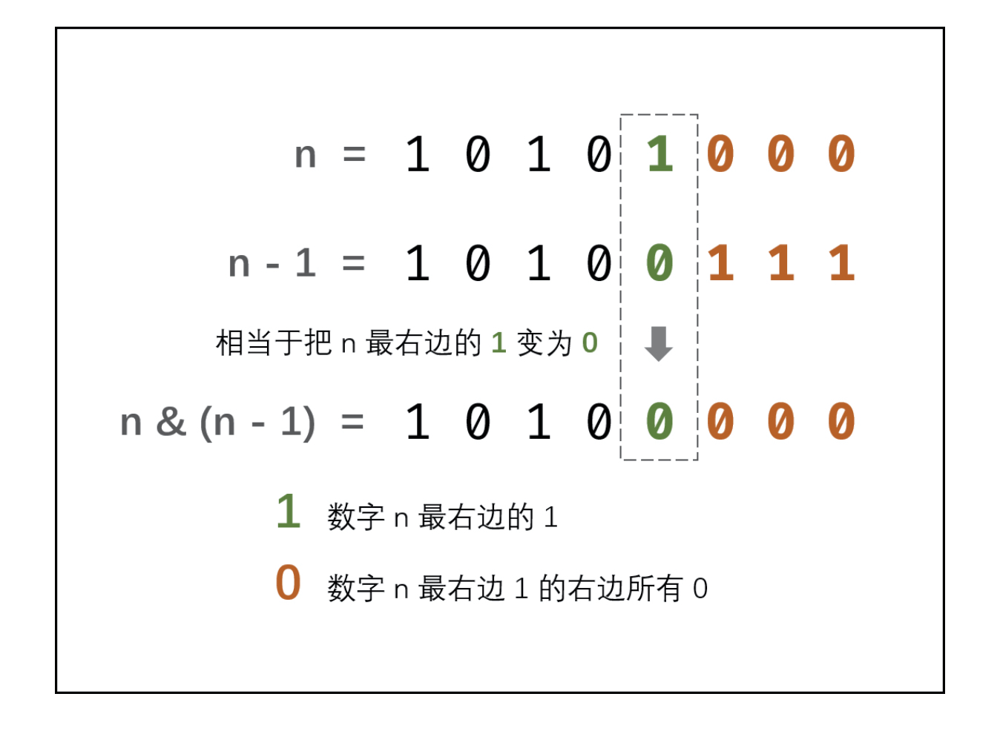

# [剑指 Offer 15. 二进制中1的个数](https://leetcode-cn.com/problems/er-jin-zhi-zhong-1de-ge-shu-lcof/)

## 解题思路

**位运算技巧：n&(n-1)，表示将二进制数字 n 最右边的 1 变成 0 其余不变。**



## 复杂度分析

**时间复杂度：O(M)**，M 表示二进制数字 n 中 1 的个数。

**空间复杂度：O(1)** 

## 代码实现

```golang
func hammingWeight(num uint32) int {
	var cnt int
	for num != 0 { // num!=0说明其中还有某位是1
		cnt++
		num &= num - 1 // 位运算技巧：将最右边的1变为0
	}
	return cnt
}
```