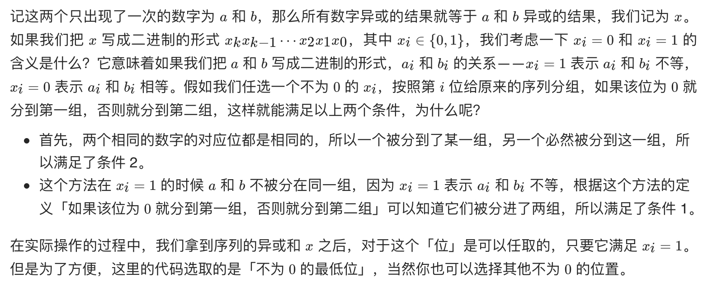

# [剑指 Offer 56 - I. 数组中数字出现的次数](https://leetcode-cn.com/problems/shu-zu-zhong-shu-zi-chu-xian-de-ci-shu-lcof/)

## 解题思路

先来考虑一个比较简单的问题：如果除了**一个**数字以外，其他数字都出现了两次，那么如何找到出现一次的数字？

**答案很简单：全员进行异或操作即可**。考虑异或操作的性质：对于两个操作数的每一位，相同结果为 0，不同结果为 1。那么在计算过程中，成对出现的数字的所有位会**两两抵消为 0**，最终得到的结果就是只出现了一次的数字。

那么这一方法如何扩展到找出两个出现一次的数字呢？如果可以把所有数字分成两组，**使得两个只出现一次的数字在不同的组中**；相同的数字会被分到相同的组中。那么对两个组分别进行异或操作，即可得到答案的两个数字。这是解决这个问题的关键。那么如何实现这样的分组呢？



解题关键是，所有数的异或和与a^b的结果一样，当异或结果中某一位为1时表示，a 与 b 这一位不相等，因此可以借此特效将 a 与 b 分配到不同组中。

## 复杂度分析

**时间复杂度：O(N)**

**空间复杂度：O(1)** 

## 代码实现

```golang
func singleNumbers(nums []int) []int {
	r := 0
	for i := 0; i < len(nums); i++ {
		r ^= nums[i]
	}
	// n & (-n) 可以得到 n 的位级表示中最低的那一位
	// 例如对于二进制表示 11110100，取负得到 00001100
	// 这两个数按位与得到 00000100
	x := r & (-r)
	a, b := 0, 0 // 表示数组中2个不相等的数
	for i := 0; i < len(nums); i++ {
		// 根据对应位的值分成2组，分别异或
		if nums[i]&x == x { // 对应位为1
			a ^= nums[i]
		} else { // 对应位为0
			b ^= nums[i]
		}
	}
	return []int{a, b}
}
```