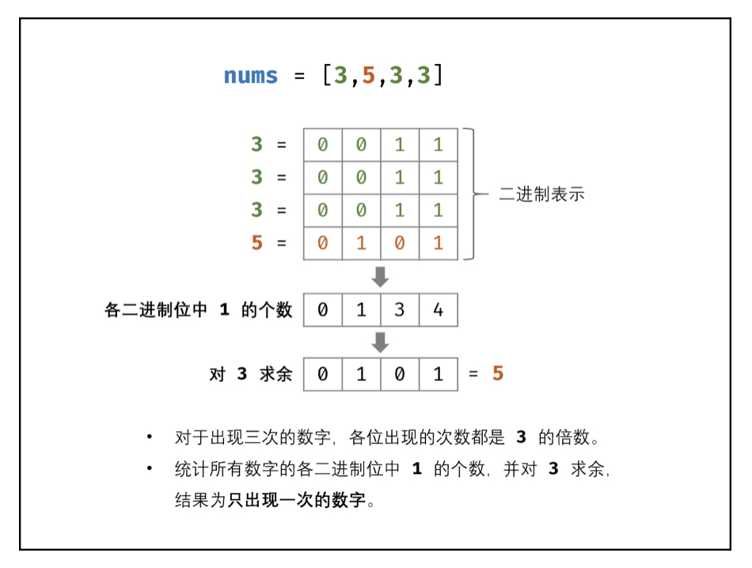

# [剑指 Offer 56 - II. 数组中数字出现的次数 II](https://leetcode-cn.com/problems/shu-zu-zhong-shu-zi-chu-xian-de-ci-shu-ii-lcof/)

## 解题思路

如下图所示，考虑数字的二进制形式，对于出现三次的数字，各**二进制位**出现的次数都是 3 的倍数。因此，统计所有数字的各二进制位中 1 的出现次数，并对 3 求余，结果则为只出现一次的数字。



**特别注意，负数的处理！**

## 复杂度分析

**时间复杂度：O(N)**

**空间复杂度：O(1)** 

## 代码实现

```golang
func singleNumber(nums []int) int {
	counts := make([]int, 32) // 记录32位的整型中每一位的位数和
	for i := 0; i < len(nums); i++ {
		for j := 0; j < 32; j++ {
			counts[j] += nums[i] & 1
			nums[i] >>= 1
		}
	}
	res, m := 0, 3
	for j := 0; j < 32; j++ {
		res <<= 1
		res |= counts[31-j] % m // 从高到低，对3求余，结果只可能是0或1
	}
	return res
}
```