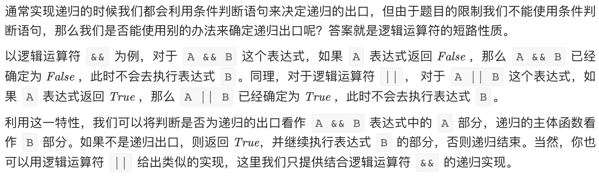

# [剑指 Offer 64. 求1+2+…+n](https://leetcode-cn.com/problems/qiu-12n-lcof/)

## 方法一：递归

## 解题思路



## 复杂度分析

**时间复杂度：O(N)**

**空间复杂度：O(1)** 

## 代码实现

```golang
func sumNums(n int) int {
	ans := 0
	var sum func(int) bool
	sum = func(n int) bool {
		ans += n
		return n > 0 && sum(n-1)
	}
	sum(n)
	return ans
}
```

## 方法二：快速乘

## 解题思路


```golang
func quickMulti(a, b int) int { // 快速乘
	ans := 0
	for ; b != 0; b >>= 1 {
		if b&1 == 1 { // b中第i位二进制位的1表示 2^i
			ans += a
		}
		a <<= 1 // 乘2操作，加权
	}
	return ans
}
```


## 复杂度分析

**时间复杂度：O(logN)**

**空间复杂度：O(1)** 

## 代码实现

```golang
func sumNums(n int) int {
	ans, A, B := 0, n, n+1
	addGreatZero := func() bool {
		ans += A
		return true
	}

	_ = ((B & 1) == 1) && addGreatZero()
	A <<= 1 // 加权
	B >>= 1

	_ = ((B & 1) == 1) && addGreatZero()
	A <<= 1
	B >>= 1

	_ = ((B & 1) == 1) && addGreatZero()
	A <<= 1
	B >>= 1

	_ = ((B & 1) == 1) && addGreatZero()
	A <<= 1
	B >>= 1

	_ = ((B & 1) == 1) && addGreatZero()
	A <<= 1
	B >>= 1

	_ = ((B & 1) == 1) && addGreatZero()
	A <<= 1
	B >>= 1

	_ = ((B & 1) == 1) && addGreatZero()
	A <<= 1
	B >>= 1

	_ = ((B & 1) == 1) && addGreatZero()
	A <<= 1
	B >>= 1

	_ = ((B & 1) == 1) && addGreatZero()
	A <<= 1
	B >>= 1

	_ = ((B & 1) == 1) && addGreatZero()
	A <<= 1
	B >>= 1

	_ = ((B & 1) == 1) && addGreatZero()
	A <<= 1
	B >>= 1

	_ = ((B & 1) == 1) && addGreatZero()
	A <<= 1
	B >>= 1

	_ = ((B & 1) == 1) && addGreatZero()
	A <<= 1
	B >>= 1

	_ = ((B & 1) == 1) && addGreatZero()
	A <<= 1
	B >>= 1
	return ans >> 1 // n*(n+1)/2
}
```

