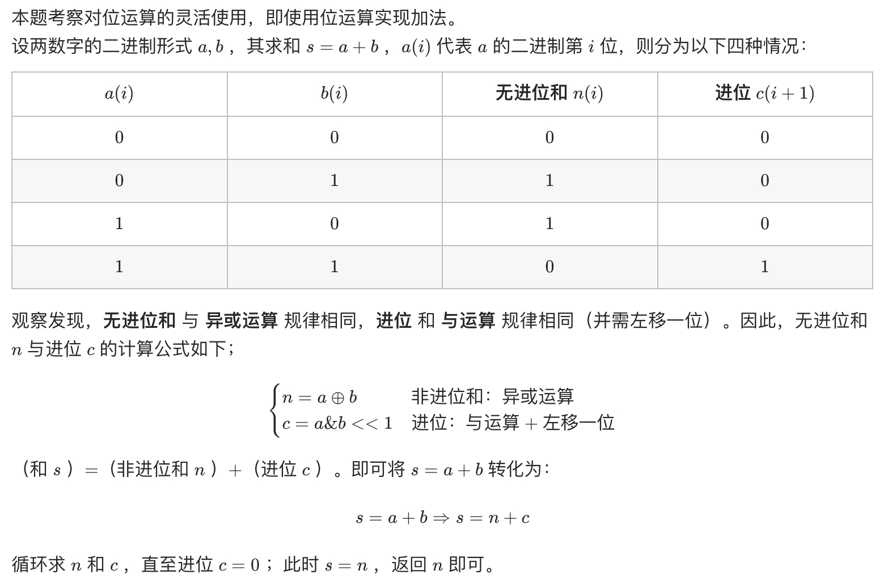
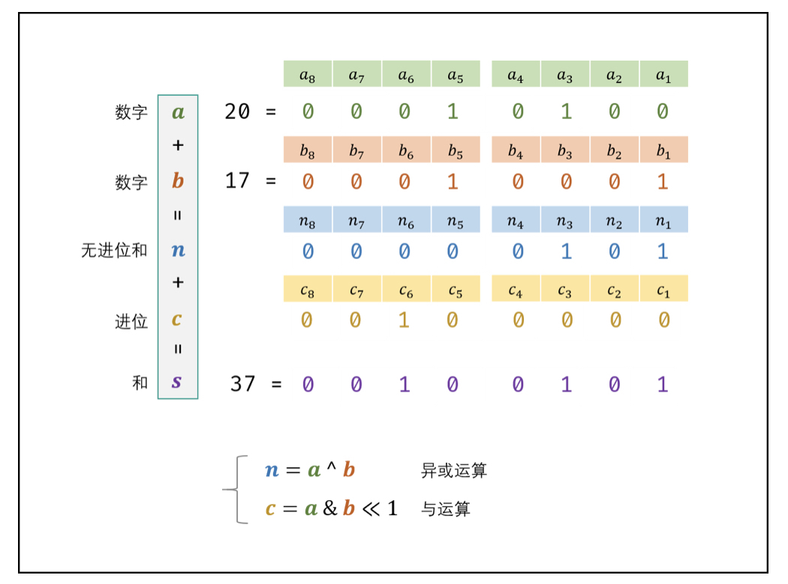
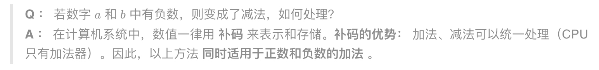

# [剑指 Offer 65. 不用加减乘除做加法](https://leetcode-cn.com/problems/bu-yong-jia-jian-cheng-chu-zuo-jia-fa-lcof/)

## 解题思路







## 复杂度分析

**时间复杂度：O(1)**

**空间复杂度：O(1)** 

## 代码实现

```golang
func add(a int, b int) int {
	for b != 0 { // 当进位为 0 时跳出
		c := (a & b) << 1 // c = 进位
		a ^= b            // a = 非进位和
		b = c             // b = 进位
	}
	return a
}
```