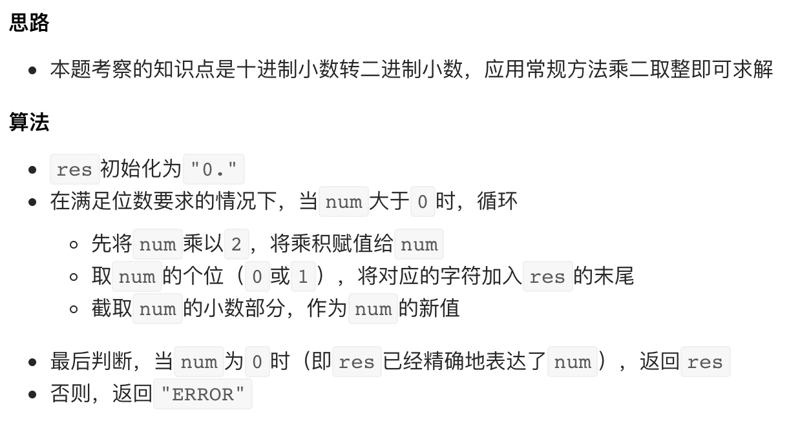

# [面试题 05.02. 二进制数转字符串](https://leetcode-cn.com/problems/bianry-number-to-string-lcci/)

## 解题思路



## 复杂度分析

**时间复杂度：O(1)**

**空间复杂度：O(1)** 

## 代码实现

```golang
func printBin(num float64) string {
	res := "0."
	// 若 "0." 计为两位，i 初始化为 30，若计为 1 位，初始化为 31
	for i := 0; i < 30 && num > 0; i++ {
		num *= 2
		if num >= 1 {
			res += "1"
			num--
		} else {
			res += "0"
		}
	}
	if num != 0 {
		return "ERROR"
	}
	return res
}
```