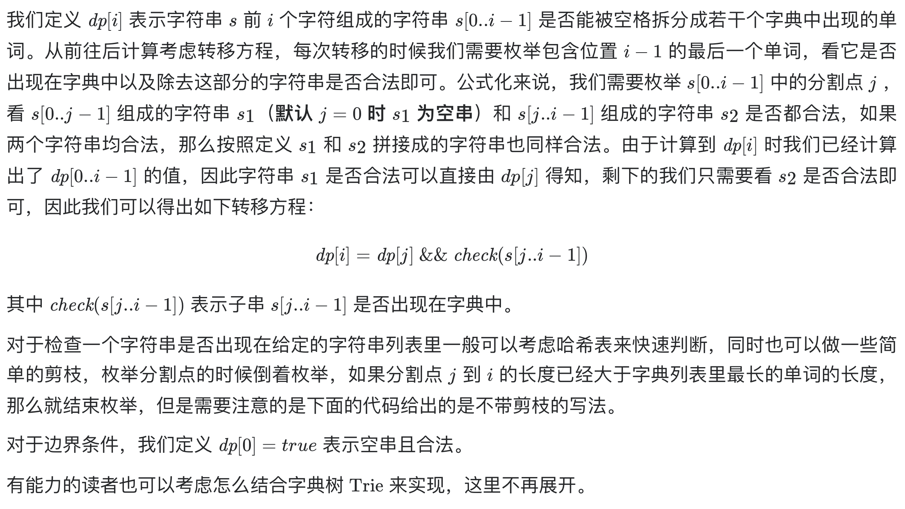

# [139. 单词拆分](https://leetcode-cn.com/problems/word-break/)

## 解题思路



## 复杂度分析

**时间复杂度：O(N^2)**

**空间复杂度：O(N)** 

## 代码实现

```golang
func wordBreak(s string, wordDict []string) bool {
	wordDictSet := make(map[string]bool)
	for _, w := range wordDict { // 将单词集合存储在map中
		wordDictSet[w] = true
	}
	dp := make([]bool, len(s)+1)   // 哨兵优化，dp[i] 表示 s[0...i-1] 是否满足要求
	dp[0] = true                   // 空字符串 满足要求
	for i := 1; i <= len(s); i++ { // 遍历长度
		for j := 0; j < i; j++ { // 遍历所有分割的情况
			if dp[j] && wordDictSet[s[j:i]] { // 若前半段字符串满足要求 并且 后半段字符串在字典中
				dp[i] = true
				break
			}
		}
	}
	return dp[len(s)]
}
```