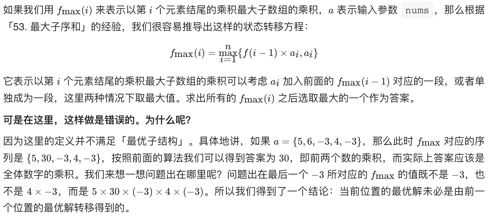
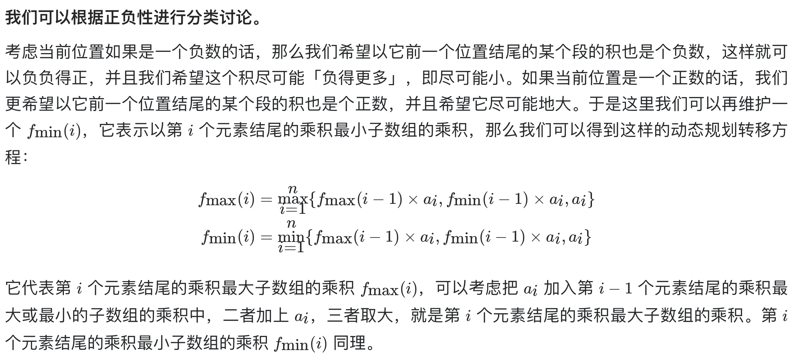
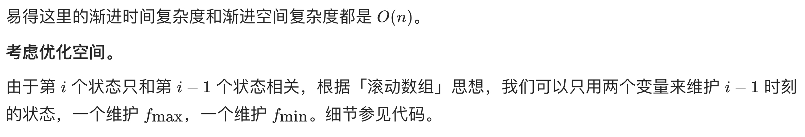

# [152. 乘积最大子数组](https://leetcode-cn.com/problems/maximum-product-subarray/)

## 解题思路







## 复杂度分析

**时间复杂度：O(N)**

**空间复杂度：O(1)** 

## 代码实现

```golang
func maxProduct(nums []int) int {
	maxF, minF, ans := nums[0], nums[0], nums[0]
	for i := 1; i < len(nums); i++ {
		mx, mn := maxF, minF // 滚动数组优化
		// 当前值、当前值*之前最大值、当前值*之前最小值，取三者最大
		maxF = max(nums[i], max(nums[i]*mx, nums[i]*mn))
		// 当前值、当前值*之前最大值、当前值*之前最小值，取三者最小，维护一个最小值
		minF = min(nums[i], min(nums[i]*mx, nums[i]*mn))
		ans = max(maxF, ans)
	}
	return ans
}

func max(x, y int) int {
	if x > y {
		return x
	}
	return y
}

func min(x, y int) int {
	if x < y {
		return x
	}
	return y
}
```