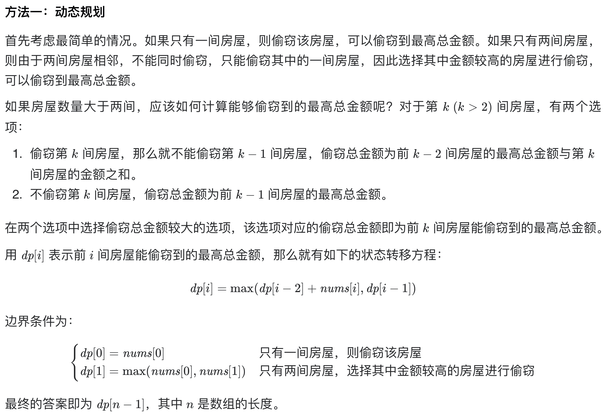

# [198. 打家劫舍](https://leetcode-cn.com/problems/house-robber/)

## 解题思路



## 复杂度分析

**时间复杂度：O(N)**

**空间复杂度：O(1)**，基于滚动数组优化，可将空间复杂度降为O(1)。 

## 代码实现（未优化，空间复杂度O(N)）

```golang
func rob(nums []int) int {
	n := len(nums)
	if n == 0 { // 特判
		return 0
	}
	if n == 1 { // 特判
		return nums[0]
	}
	dp := make([]int, n) // dp[i] 表示偷窃到第i家的最大金额
	dp[0] = nums[0]
	dp[1] = max(nums[0], nums[1])
	for i := 2; i < n; i++ { // 动态规划，状态转移
		dp[i] = max(dp[i-2]+nums[i], dp[i-1])
	}
	return dp[n-1]
}

func max(a, b int) int {
	if a > b {
		return a
	}
	return b
}
```

## 代码实现（滚动数组优化，空间复杂度O(1)）

```golang
func rob(nums []int) int {
	n := len(nums)
	if n == 0 { // 特判
		return 0
	}
	if n == 1 { // 特判
		return nums[0]
	}
	// dp[i] 表示偷窃到第i家的最大金额
	dp1, dp2 := nums[0], max(nums[0], nums[1])
	for i := 2; i < n; i++ { // 动态规划，状态转移
		dp1, dp2 = dp2, max(dp1+nums[i], dp2)
	}
	return dp2
}

func max(a, b int) int {
	if a > b {
		return a
	}
	return b
}
```

