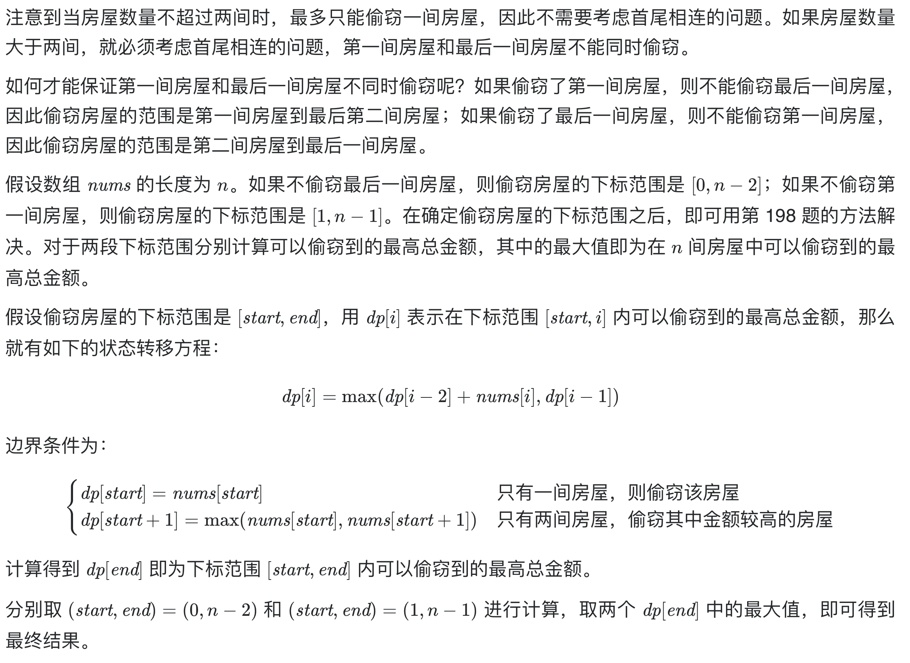

# [213. 打家劫舍 II](https://leetcode-cn.com/problems/house-robber-ii/)

## 解题思路



根据上述思路，可以得到时间复杂度 O(n) 和空间复杂度 O(n) 的实现。**考虑到每间房屋的最高总金额只和该房屋的前两间房屋的最高总金额相关，因此可以使用滚动数组，在每个时刻只需要存储前两间房屋的最高总金额，将空间复杂度降到 O(1)**。

## 复杂度分析

**时间复杂度：O(N)**

**空间复杂度：O(1)** 

## 代码实现（未优化，空间复杂度O(N)）

```golang
func rob(nums []int) int {
	n := len(nums)
	if n == 0 { // 特判
		return 0
	}
	if n == 1 { // 特判
		return nums[0]
	}
	dp := make([]int, n) // dp[i] 表示偷窃到第i家的最大金额

	// 情况1，偷窃第一家：[0,n-2]
	dp[0] = nums[0]
	dp[1] = max(nums[0], nums[1])
	for i := 2; i < n-1; i++ { // 动态规划，状态转移
		dp[i] = max(dp[i-2]+nums[i], dp[i-1])
	}
	res := dp[n-2]

	// 情况2，不偷窃第一家：[1,n-1]
	dp[0] = 0
	dp[1] = nums[1]
	for i := 2; i < n; i++ { // 动态规划，状态转移
		dp[i] = max(dp[i-2]+nums[i], dp[i-1])
	}
	res = max(res, dp[n-1])
	return res
}

func max(a, b int) int {
	if a > b {
		return a
	}
	return b
}
```

## 代码实现（滚动数组优化，空间复杂度O(1)）

```golang
func rob(nums []int) int {
	n := len(nums)
	if n == 0 { // 特判
		return 0
	}
	if n == 1 { // 特判
		return nums[0]
	}
	// dp[i] 表示偷窃到第i家的最大金额
	// 情况1，偷窃第一家：[0,n-2]
	dp1, dp2 := nums[0], max(nums[0], nums[1]) // 滚动数组优化
	for i := 2; i < n-1; i++ {                 // 动态规划，状态转移
		dp1, dp2 = dp2, max(dp1+nums[i], dp2)
	}
	res := dp2

	// 情况2，不偷窃第一家：[1,n-1]
	dp1, dp2 = 0, nums[1]    // 滚动数组优化
	for i := 2; i < n; i++ { // 动态规划，状态转移
		dp1, dp2 = dp2, max(dp1+nums[i], dp2)
	}
	res = max(res, dp2)
	return res
}

func max(a, b int) int {
	if a > b {
		return a
	}
	return b
}
```

