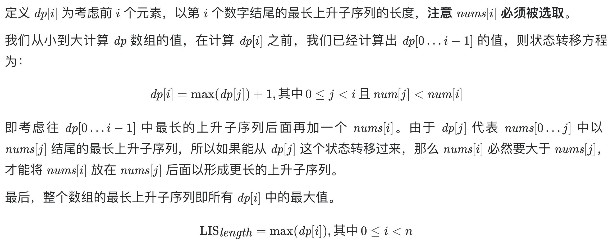

# [300. 最长递增子序列](https://leetcode-cn.com/problems/longest-increasing-subsequence/)

## 解题思路

基于**动态规划思想**，当处理第 i 个元素的时候，要求得第 i 个元素最长递增子序列的长度是多少，**与前面步骤中递增子序列以哪个元素结尾有关系**。那么前面步骤中递增子序列可能的结尾是第0个元素，第1个元素，第2个元素…第i-1个元素。如果我们能分别知道以这些元素结尾的最长递增子序列的长度，就可以推导出以第 i 个元素为结尾的最长递增子序列的长度。用 max_lcs[i] 来记录以第 i 个元素为结尾的最长递增子序列的长度。那么设 j=0,1,2…i-1，当 nums[i]>nums[j] 的时候，max_lcs[j]+1 就是一个可能的值。从这些值中取最大值，就是 max_lcs[i] 的值。



## 复杂度分析

**时间复杂度：O(N^2)**

**空间复杂度：O(N)** 

## 代码实现

```golang
func lengthOfLIS(nums []int) int {
	n := len(nums)
	if n == 0 { // 特判
		return 0
	}
	dp := make([]int, n) // 表示以nums[i]为结尾的最长递增子序列的长度
	for i := range dp {  // 初始化，已nums[i]结尾，至少长度为1
		dp[i] = 1
	}
	maxLen := 1
	for i := 0; i < n; i++ { // 遍历dp
		for j := i - 1; j >= 0; j-- { // 逐一遍历以之前字符为结尾的最长递增子序列长度
			if nums[i] > nums[j] {
				dp[i] = max(dp[i], dp[j]+1)
			}
		}
		maxLen = max(maxLen, dp[i])
	}
	return maxLen
}

func max(a, b int) int {
	if a > b {
		return a
	}
	return b
}
```