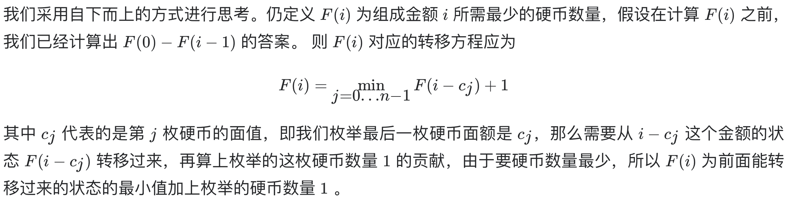

# [322. 零钱兑换](https://leetcode-cn.com/problems/coin-change/)

## 解题思路



本题若求所有方案集合，可以参考题目 [39. 组合总和](https://github.com/WTongStudio/LeetCode/blob/master/算法/回溯法/39.%20组合总和.md) 使用DFS搜索

## 复杂度分析

**时间复杂度：O(SN)**，其中 S 是金额，n 是面额数。我们一共需要计算 O(S) 个状态，S 为题目所给的总金额。对于每个状态，每次需要枚举 n 个面额来转移状态，所以一共需要 O(Sn) 的时间复杂度。

**空间复杂度：O(S)**，数组 dp 需要开长度为总金额 S 的空间。 

## 代码实现

```golang
func coinChange(coins []int, amount int) int {
	dp := make([]int, amount+1) // 哨兵优化，dp[i] 表示组成金额 i 所需的最小硬币数
	max := amount + 1
	for i := range dp { // 初始化
		dp[i] = max
	}
	dp[0] = 0
	for i := 1; i <= amount; i++ { // 遍历 dp，i 从 1 开始
		for j := 0; j < len(coins); j++ { // 遍历所有硬币面额
			if coins[j] <= i {
				dp[i] = min(dp[i], dp[i-coins[j]]+1) // 枚举所有名额，假设组成 i 已经使用了 coins[j]
			}
		}
	}
	if dp[amount] > amount { // 此时 dp[amount]==max
		return -1
	}
	return dp[amount]
}
func min(a, b int) int {
	if a < b {
		return a
	}
	return b
}
```

## 相关题目

[39. 组合总和](https://github.com/WTongStudio/LeetCode/blob/master/算法/回溯法/39.%20组合总和.md)