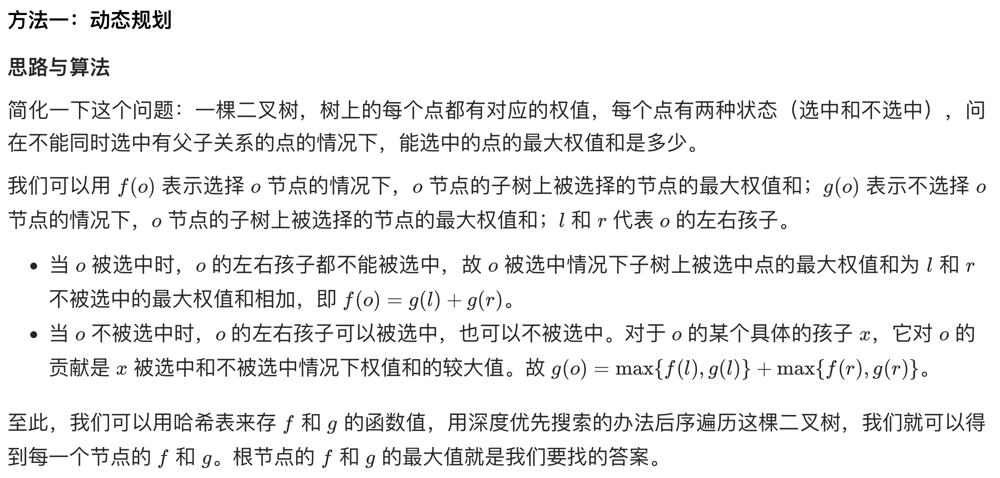

# [337. 打家劫舍 III](https://leetcode-cn.com/problems/house-robber-iii/)

## 解题思路



## 复杂度分析

**时间复杂度：O(N)**

**空间复杂度：O(N)** 

## 代码实现（未空间优化）

```golang
type TreeNode struct {
	Val   int
	Left  *TreeNode
	Right *TreeNode
}

func rob(root *TreeNode) int {
	// f(node)表示选择该节点情况下，该节点子树上被选择节点的最大权值和
	// g(node)表示不选择该节点情况下，该节点子树上被选择节点的最大权值和
	f, g := make(map[*TreeNode]int), make(map[*TreeNode]int)
	dfs(root, f, g)
	return max(f[root], g[root])
}

func dfs(node *TreeNode, f, g map[*TreeNode]int) {
	if node == nil {
		return
	}
	// 深度优先搜索，相当于后续遍历
	dfs(node.Left, f, g)
	dfs(node.Right, f, g)
	f[node] = node.Val + g[node.Left] + g[node.Right]
	g[node] = max(f[node.Left], g[node.Left]) + max(f[node.Right], g[node.Right])
}

func max(a, b int) int {
	if a > b {
		return a
	}
	return b
}
```

假设二叉树的节点个数为 n。可以看出，以上的算法对二叉树做了一次后序遍历，时间复杂度是 O(n)；**由于递归会使用到栈空间，空间代价是 O(n)，哈希表的空间代价也是 O(n)，故空间复杂度也是 O(n)**。

我们可以做一个小小的优化，我们发现**无论是 f(o) 还是 g(o)，他们最终的值只和 f(l)、g(l)、f(r)、g(r) 有关，所以对于每个节点，我们只关心它的孩子节点们的 f 和 g 是多少**。我们可以设计一个结构，表示某个节点的 f 和 g 值，在每次递归返回的时候，都把这个点对应的 f 和 g 返回给上一级调用，这样可以省去哈希表的空间。

## 代码实现

```golang
func rob(root *TreeNode) int {
	res := dfs(root)
	// res[0]表示选择盗窃root节点的结果
	// res[1]表示不选择盗窃root节点的结果
	return max(res[0], res[1])
}

func dfs(node *TreeNode) []int {
	if node == nil {
		return []int{0, 0}
	}
	// 深度优先搜索，相当于后续遍历
	l := dfs(node.Left)  // 左子树的权值总和
	r := dfs(node.Right) // 右子树的权值总和
	selected := node.Val + l[1] + r[1]
	notSelected := max(l[0], l[1]) + max(r[0], r[1])
	return []int{selected, notSelected}
}

func max(a, b int) int {
	if a > b {
		return a
	}
	return b
}
```

