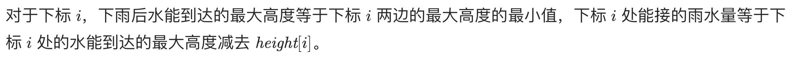
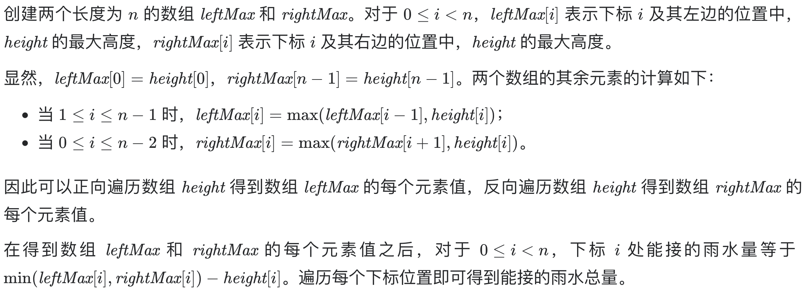
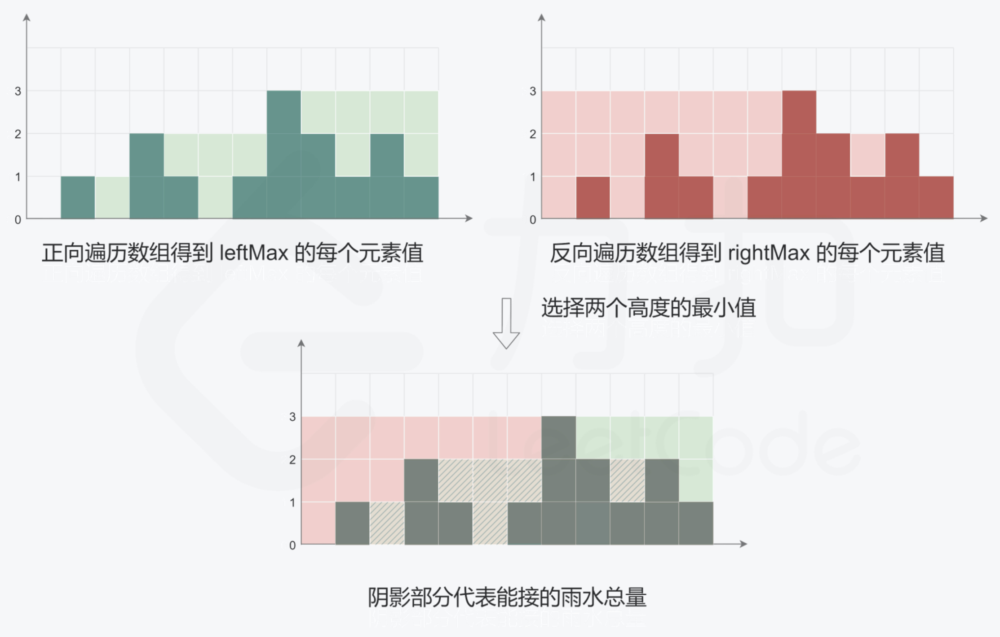

# [42. 接雨水](https://leetcode-cn.com/problems/trapping-rain-water/)

## 解题思路（动态规划）







## 复杂度分析

**时间复杂度：O(N)**

**空间复杂度：O(N)** 

## 代码实现

```golang
func trap(height []int) int {
	n := len(height)
	leftMax := make([]int, n)
	rightMax := make([]int, n)
	lmax, rmax := 0, 0
	for i := 0; i < n; i++ { // 一次遍历，计算出两个数组的值
		if height[i] > lmax { // 正向取值
			lmax = height[i]
		}
		leftMax[i] = lmax
		if height[n-i-1] > rmax { // 反向取值
			rmax = height[n-i-1]
		}
		rightMax[n-i-1] = rmax
	}
	res := 0
	for i := 0; i < n; i++ { // 下标 i 处，能接到的雨水量为左右两边最大高度的最小值 减去 i 处的高度
		res += min(leftMax[i], rightMax[i]) - height[i]
	}
	return res
}
func min(a, b int) int {
	if a < b {
		return a
	}
	return b
}
```

