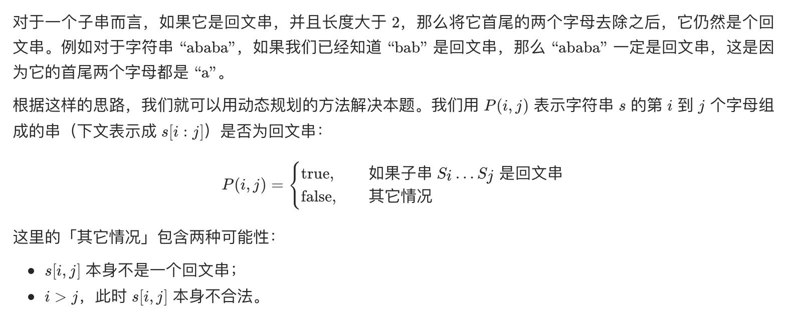

# [5. 最长回文子串](https://leetcode-cn.com/problems/longest-palindromic-substring/)

## 方法一：动态规划

## 解题思路




**注意遍历更新 dp 时的方式，是按照子串长度遍历的**。

## 复杂度分析

**时间复杂度：O(N^2)**

**空间复杂度：O(N^2)** 

## 代码实现

```golang
func longestPalindrome(s string) string {
	n := len(s)
	if n < 2 { // 特判
		return s
	}
	// dp[i][j] 表示字符串以 s[i] 开头 s[j] 结尾的字符串是否为回文
	dp := make([][]bool, n)
	for i := range dp {
		dp[i] = make([]bool, n)
	}
	for i := 0; i < n; i++ { // 初始化
		dp[i][i] = true
	}
	maxLen := 1
	begin := 0
	for l := 2; l <= n; l++ { // 先遍历子串长度
		for i := 0; i < n; i++ { // 遍历左边界，左边界的上限设置可以宽松一些
			j := l + i - 1 // 计算右边界
			if j >= n {    // 如果右边界越界，就可以退出当前循环
				break
			}
			if s[i] == s[j] {
				if l == 2 { // 特判，当l==2时，i+1>j-1，dp[i+1][j-1]会溢出
					dp[i][j] = true
				} else {
					dp[i][j] = dp[i+1][j-1]
				}
			}
			if dp[i][j] && j-i+1 > maxLen {
				maxLen = j - i + 1
				begin = i
			}
		}
	}
	return s[begin : begin+maxLen]
}
```

## 方法二：中心扩展算法（推荐）

## 解题思路


## 复杂度分析

**时间复杂度：O(N^2)**

**空间复杂度：O(1)** 

## 代码实现

```go
func longestPalindrome(s string) string {
	if s == "" { // 特判
		return ""
	}
	start, end := 0, 0
	for i := 0; i < len(s); i++ { // 遍历所有边界条件，即可以作为回文中心的子串
		left1, right1 := expandAroundCenter(s, i, i)   // 中心一个字符
		left2, right2 := expandAroundCenter(s, i, i+1) // 中心两个字符
		if right1-left1 > end-start {
			start, end = left1, right1 // 更新结果
		}
		if right2-left2 > end-start {
			start, end = left2, right2 // 更新结果
		}
	}
	return s[start : end+1] // s[a:b] 不包含 s[b]，所以 end+1
}

func expandAroundCenter(s string, left, right int) (int, int) {
	for left >= 0 && right < len(s) && s[left] == s[right] { // 注意需要判断 s[left] == s[right]，有可能不相等
		left, right = left-1, right+1
	}
	return left + 1, right - 1 // 注意进行回滚，发回满足条件的 left, right
}
```

