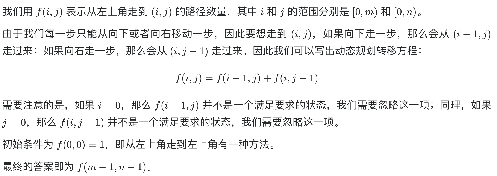

# [62. 不同路径](https://leetcode-cn.com/problems/unique-paths/)

## 解题思路



## 复杂度分析

**时间复杂度：O(NM)**

**空间复杂度：O(NM)**，即为存储所有状态需要的空间。注意到 f(i,j) 仅与第 i 行和第 i−1 行的状态有关，因此我们可以使用滚动数组代替代码中的二维数组，使空间复杂度降低为 O(n)。此外，由于我们交换行列的值并不会对答案产生影响，因此我们总可以通过交换 m 和 n 使得 m≤n，这样**空间复杂度降低至 O(min(m,n))**。

## 代码实现（未空间优化）

```golang
func uniquePaths(m int, n int) int {
	dp := make([][]int, m)
	for i := range dp {
		dp[i] = make([]int, n)
	}
	for i := 0; i < m; i++ { // 初始化第一列
		dp[i][0] = 1
	}
	for j := 0; j < n; j++ { // 初始化第一行
		dp[0][j] = 1
	}
	for i := 1; i < m; i++ {
		for j := 1; j < n; j++ {
			dp[i][j] = dp[i-1][j] + dp[i][j-1]
		}
	}
	return dp[m-1][n-1]
}
```

## 代码实现（两个滚动数组优化）

```go
func uniquePaths(m int, n int) int {
	pre := make([]int, n)    // 记录上一行的结果
	cur := make([]int, n)    // 记录当前行的结果
	for i := 0; i < n; i++ { // 初始化
		pre[i] = 1
		cur[i] = 1
	}
	for i := 1; i < m; i++ {
		for j := 1; j < n; j++ {
			cur[j] = pre[j] + cur[j-1]
		}
		copy(pre, cur)
	}
	return cur[n-1]
}
```

## 代码实现（一个滚动数组优化）

```go
func uniquePaths(m int, n int) int {
	cur := make([]int, n)    // 记录当前行及上一行的部分结果
	for i := 0; i < n; i++ { // 初始化
		cur[i] = 1
	}
	for i := 1; i < m; i++ {
		for j := 1; j < n; j++ {
			cur[j] = cur[j] + cur[j-1]
		}
	}
	return cur[n-1]
}
```

## 相关题目

[63. 不同路径 II](https://github.com/WTongStudio/LeetCode/blob/master/算法/动态规划/63.%20不同路径%20II.md)
