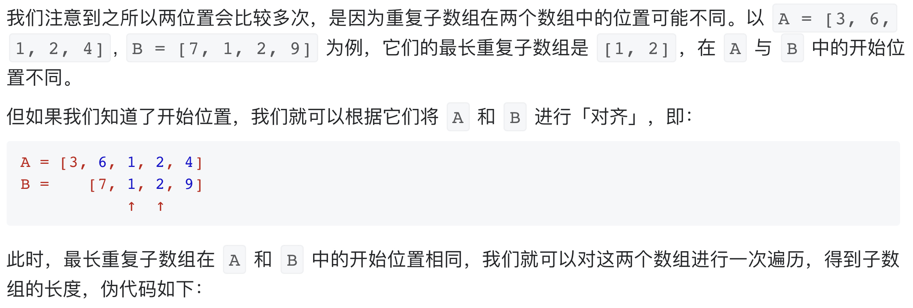
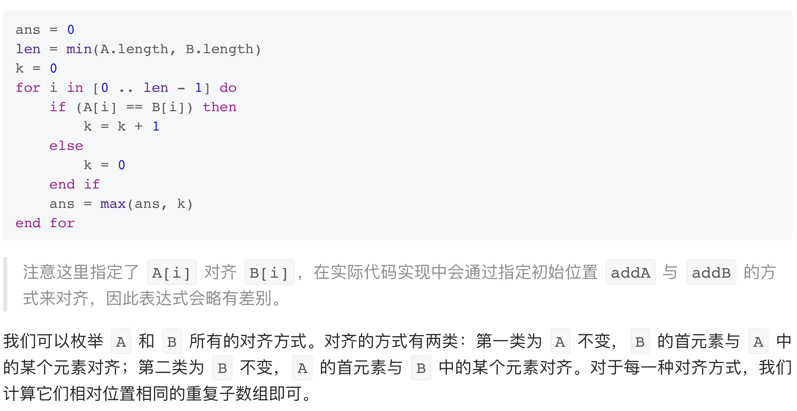
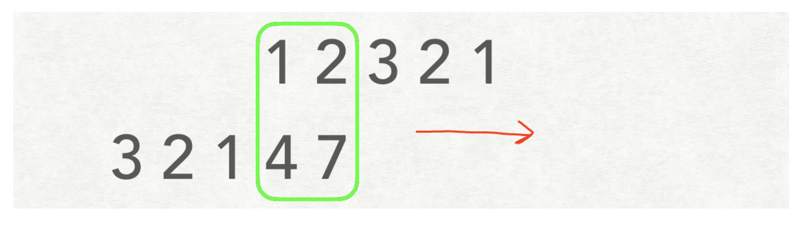

# [718. 最长重复子数组](https://leetcode-cn.com/problems/maximum-length-of-repeated-subarray/)

## 方法一：动态规划

## 解题思路

动态规划思想，注意使用哨兵优化初始化，`dp[i][j]`表示以`nums1[i-1]`和`nums2[j-1]`结尾的最长连续子序列（包含这2个值）。

## 复杂度分析

**时间复杂度：O(NM)**

**空间复杂度：O(NM)** 

## 代码实现

```golang
func findLength(nums1 []int, nums2 []int) int {
	n, m := len(nums1), len(nums2)
	dp := make([][]int, n+1) // 哨兵优化，dp[i][j]表示以nums1[i-1]和nums2[j-1]结尾的最长连续子序列（包含这2个值）
	for i := range dp {      // 初始化
		dp[i] = make([]int, m+1)
	}
	longest := 0
	for i := 1; i <= n; i++ {
		for j := 1; j <= m; j++ {
			if nums1[i-1] == nums2[j-1] { // 若连续则累加
				dp[i][j] = dp[i-1][j-1] + 1
			} else { // 若不连续，则清零
				dp[i][j] = 0
			}
			if dp[i][j] > longest { // 记录最大值
				longest = dp[i][j]
			}
		}
	}
	return longest
}
```

## 方法二：滑动窗口

## 解题思路







## 复杂度分析

**时间复杂度：O((N+M)*min(N,M))**

**空间复杂度：O(1)** 

## 代码实现

```go
func findLength(A []int, B []int) int {
	n, m := len(A), len(B)
	ret := 0
	for i := 0; i < n; i++ { // A[i]对齐B[0]
		len := min(m, n-i)
		maxLen := maxLength(A, B, i, 0, len)
		ret = max(ret, maxLen)
	}
	for i := 0; i < m; i++ { // B[i]对齐A[0]
		len := min(n, m-i)
		maxLen := maxLength(A, B, 0, i, len)
		ret = max(ret, maxLen)
	}
	return ret
}

func maxLength(A, B []int, offsetA, offsetB, len int) int {
	ret, k := 0, 0
	for i := 0; i < len; i++ {
		if A[offsetA+i] == B[offsetB+i] { // 若相等则累计
			k++
		} else { // 若不相等则清零
			k = 0
		}
		ret = max(ret, k)
	}
	return ret
}

func max(x, y int) int {
	if x > y {
		return x
	}
	return y
}

func min(x, y int) int {
	if x < y {
		return x
	}
	return y
}
```

