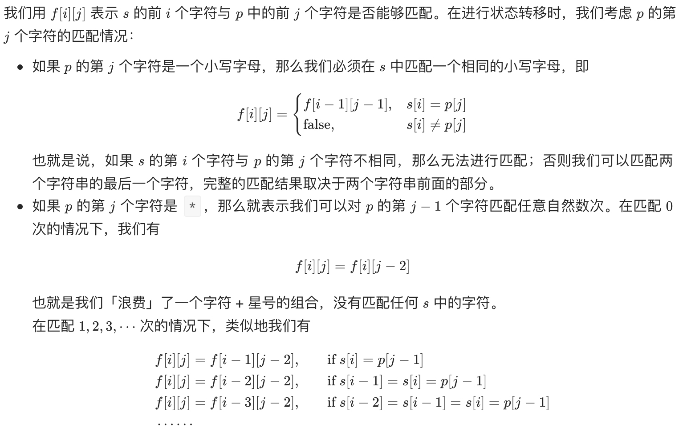
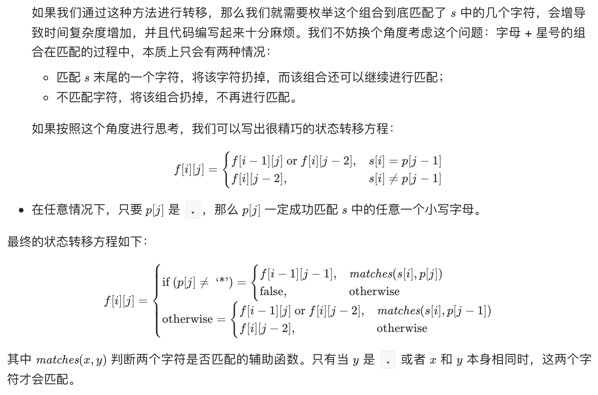
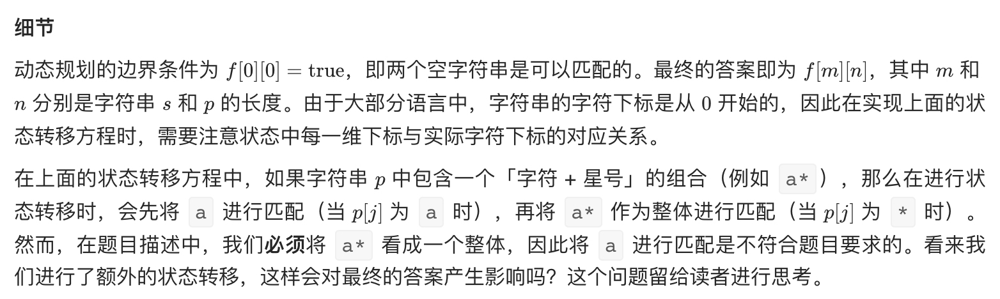

# [剑指 Offer 19. 正则表达式匹配](https://leetcode-cn.com/problems/zheng-ze-biao-da-shi-pi-pei-lcof/)

## 解题思路

题目中的匹配是一个「逐步匹配」的过程：每次从字符串 p 中取出一个字符或者「字符 + 星号」的组合，并在 s 中进行匹配。对于 p 中一个字符而言，它只能在 s 中匹配一个字符，匹配的方法具有唯一性；**而对于 p 中字符 + 星号的组合而言，它可以在 s 中匹配任意自然数个字符，并不具有唯一性**。因此可以考虑使用动态规划，对匹配的方案进行枚举。







## 复杂度分析

**时间复杂度：O(NM)**

**空间复杂度：O(NM)** 

## 代码实现

```golang
func isMatch(s string, p string) bool {
	m, n := len(s), len(p)
	matches := func(i, j int) bool {
		if i == 0 {
			return false
		}
		if p[j-1] == '.' { // j-1 是因为哨兵优化
			return true
		}
		return s[i-1] == p[j-1] // i-1,j-1 是因为哨兵优化
	}
	f := make([][]bool, m+1) // 哨兵优化
	for i := 0; i < len(f); i++ {
		f[i] = make([]bool, n+1)
	}
	f[0][0] = true // 两个空字符串可以匹配
	for i := 0; i <= m; i++ {
		for j := 1; j <= n; j++ {
			if p[j-1] == '*' {
				f[i][j] = f[i][j] || f[i][j-2] // * 匹配 0 个的情况
				if matches(i, j-1) {           // s[i] 与 p[j-1] 匹配，则继续向前匹配
					f[i][j] = f[i][j] || f[i-1][j]
				}
			} else if matches(i, j) { // p[j] 为字符 或 . 的情况
				f[i][j] = f[i][j] || f[i-1][j-1]
			}
		}
	}
	return f[m][n]
}
```