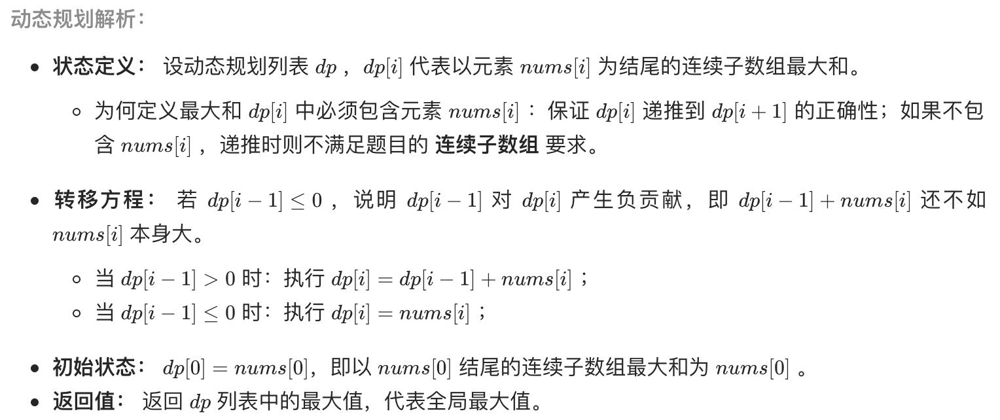
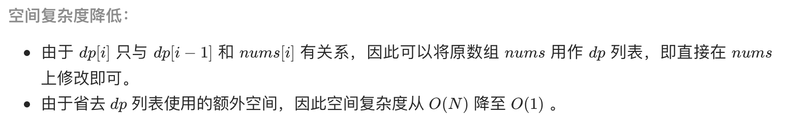

# [剑指 Offer 42. 连续子数组的最大和](https://leetcode-cn.com/problems/lian-xu-zi-shu-zu-de-zui-da-he-lcof/)

## 解题思路





## 复杂度分析

**时间复杂度：O(N)**

**空间复杂度：O(1)** 

## 代码实现

```golang
func maxSubArray(nums []int) int {
	max := nums[0]
	for i := 1; i < len(nums); i++ {
		// nums[i] 即 dp[i]
		// 表示以 nums[i] 为结尾的连续子数组和的最大值
		if nums[i-1] > 0 { // 正贡献
			nums[i] += nums[i-1]
		}
		// 若 nums[i-1] <= 0
		// 表示 i 之前的连续子数组和小于 0 为负贡献，可以舍弃

		if nums[i] > max {
			max = nums[i]
		}
	}
	return max
}
```