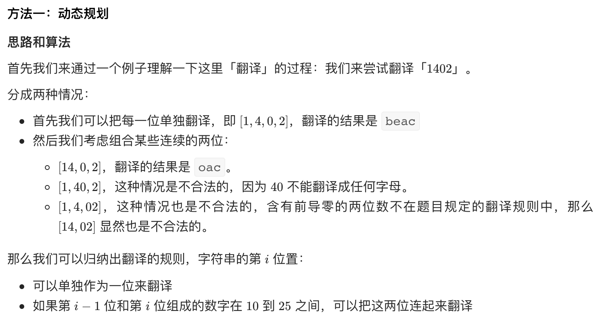
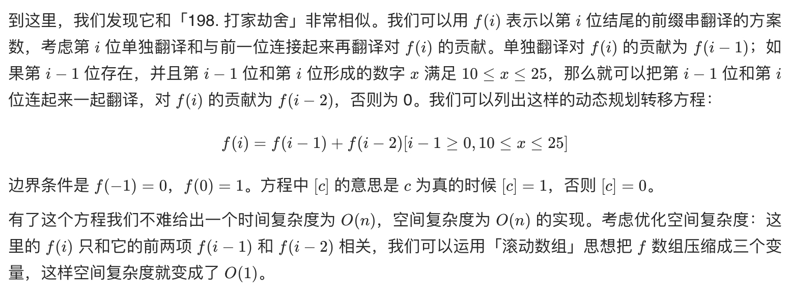

# [剑指 Offer 46. 把数字翻译成字符串](https://leetcode-cn.com/problems/ba-shu-zi-fan-yi-cheng-zi-fu-chuan-lcof/)

## 解题思路





## 复杂度分析

**时间复杂度：O(logN)**，循环的次数是 n 的位数，故渐进时间复杂度为 O(log⁡n)。

**空间复杂度：O(logN)**，虽然这里用了滚动数组，动态规划部分的空间代价是 O(1) 的，但是这里用了一个临时变量把数字转化成了字符串，故渐进空间复杂度也是 O(logn)。

## 代码实现

```golang

```