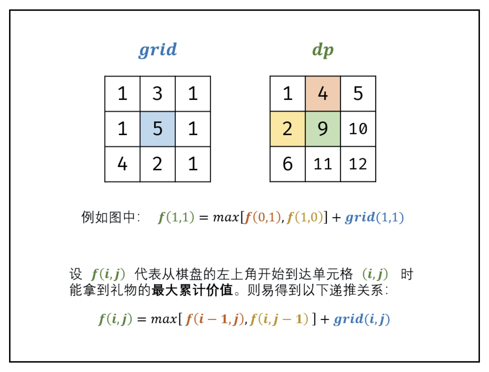
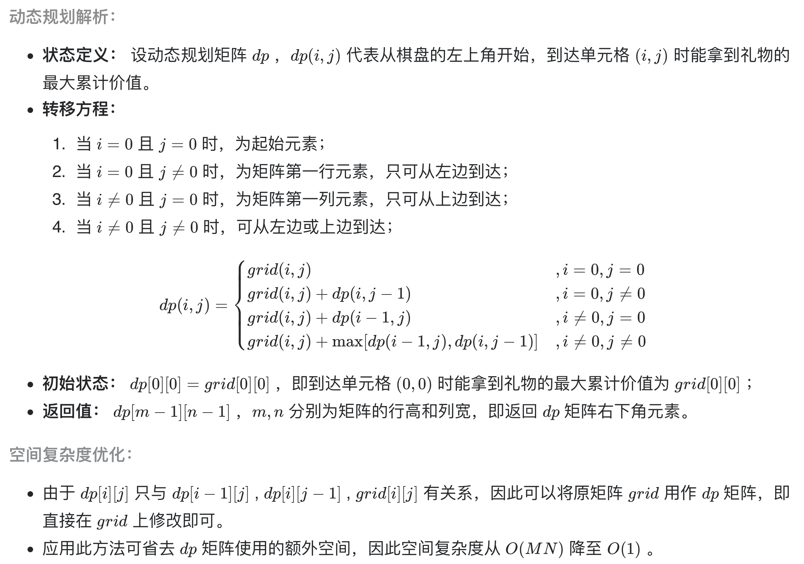

# [剑指 Offer 47. 礼物的最大价值](https://leetcode-cn.com/problems/li-wu-de-zui-da-jie-zhi-lcof/)

## 方法一：深度优先搜索+回溯法（陷阱）

## 解题思路

深度优先搜索+回溯法，可以参考题目：[剑指 Offer 13. 机器人的运动范围](https://github.com/WTongStudio/LeetCode/blob/master/算法/回溯法/剑指%20Offer%2013.%20机器人的运动范围.md)。

## 复杂度分析

**时间复杂度：O(NM)**

**空间复杂度：O(1)** 

## 代码实现（陷阱）

```golang
func maxValue(grid [][]int) int {
	if len(grid) == 0 || len(grid[0]) == 0 { // 特判
		return 0
	}
	var max int
	n, m := len(grid), len(grid[0])
	dfs(grid, n, m, 0, 0, 0, &max)
	return max
}

func dfs(grid [][]int, n, m, i, j, sum int, max *int) {
	if i == n || j == m { // 终止条件
		return
	}
	sum += grid[i][j]
	if i == n-1 && j == m-1 && sum > *max {
		*max = sum
	}
	dfs(grid, n, m, i+1, j, sum, max)
	dfs(grid, n, m, i, j+1, sum, max)
	sum -= grid[i][j] // 回溯
}
```

## 问题延伸

**上述代码直接使用递归的 DFS 回溯会导致超时！！！**

本题有个陷阱（数组过大）：

- 0 < grid.length <= 200
- 0 < grid[0].length <= 200

因为 DFS 重复计算项太多了，**可以用 map 将每种计算结果记录下来，防止重复计算**。

## 方法二：动态规划（最优解）

## 解题思路

从棋盘的左上角开始拿格子里的礼物，并每次 **向右** 或者 **向下** 移动一格、直到到达棋盘的右下角。根据题目说明，易得某单元格只可能从上边单元格或左边单元格到达。

设 f(i,j) 为从棋盘左上角走至单元格 (i,j) 的礼物最大累计价值，易得到以下递推关系：f(i,j) 等于 f(i,j−1) 和 f(i−1,j) 中的较大值加上当前单元格礼物价值 grid(i,j) 。






## 复杂度分析

**时间复杂度：O(NM)**

**空间复杂度：O(1)** 

## 代码实现（哨兵优化，空间复杂度O(NM)）

```golang
func maxValue(grid [][]int) int {
	n, m := len(grid), len(grid[0])
	dp := make([][]int, n+1) // 哨兵优化，最上一行与最左一行为 0
	for i := range dp {
		dp[i] = make([]int, m+1)
	}
	for i := 0; i < n; i++ {
		for j := 0; j < m; j++ {
			if dp[i][j+1] > dp[i+1][j] {
				dp[i+1][j+1] = grid[i][j] + dp[i][j+1]
			} else {
				dp[i+1][j+1] = grid[i][j] + dp[i+1][j]
			}
		}
	}
	return dp[n][m]
}
```

## 代码实现（空间优化）

```golang
func maxValue(grid [][]int) int {
	n, m := len(grid), len(grid[0])
	for i := 0; i < n; i++ {
		for j := 0; j < m; j++ {
			if i == 0 && j == 0 {
				continue
			}
			if i == 0 {
				grid[i][j] += grid[i][j-1]
			} else if j == 0 {
				grid[i][j] += grid[i-1][j]
			} else {
				if grid[i][j-1] >= grid[i-1][j] {
					grid[i][j] += grid[i][j-1]
				} else {
					grid[i][j] += grid[i-1][j]
				}
			}
		}
	}
	return grid[n-1][m-1]
}
```

