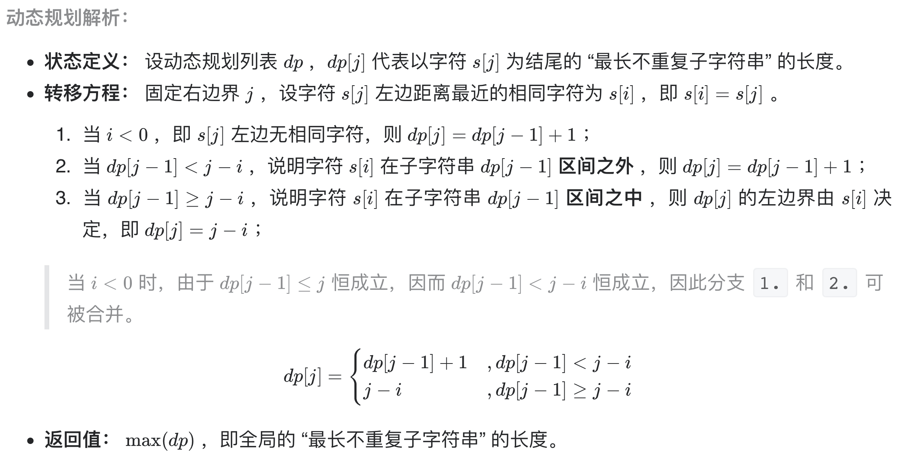
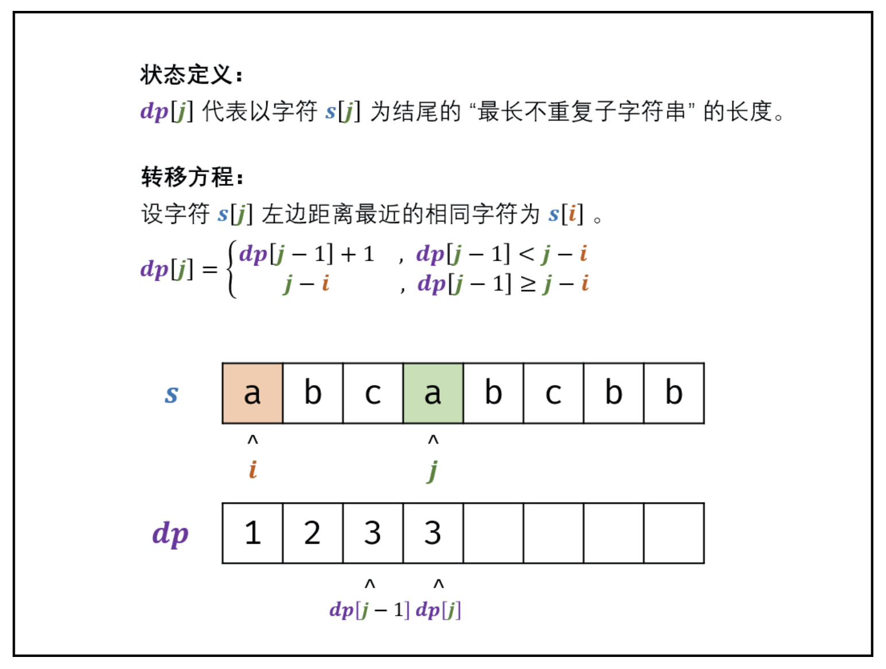
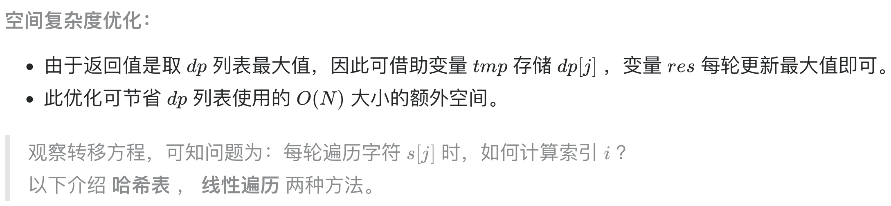
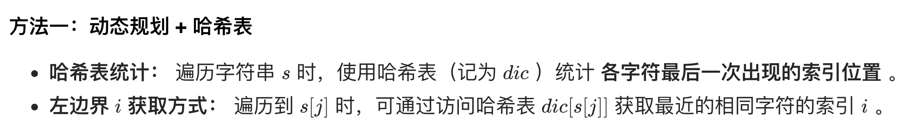
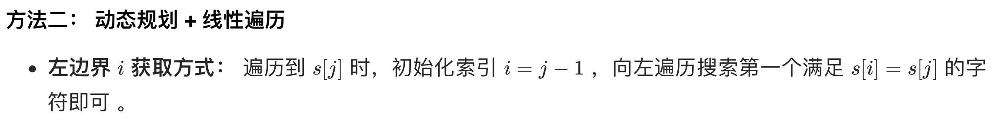

# [剑指 Offer 48. 最长不含重复字符的子字符串](https://leetcode-cn.com/problems/zui-chang-bu-han-zhong-fu-zi-fu-de-zi-zi-fu-chuan-lcof/)

## 方法一：动态规划+哈希表

## 解题思路









## 复杂度分析

**时间复杂度：O(N)**， 其中 N 为字符串长度，动态规划需遍历计算 dp 列表。

**空间复杂度：O(1)**，字符的 ASCII 码范围为 0 ~ 127 ，哈希表 dic 最多使用 O(128)=O(1) 大小的额外空间。

## 代码实现（滚动数组优化）

```golang
func lengthOfLongestSubstring(s string) int {
	dic := make(map[byte]int)
	dp := 0 // 用一个值当做滚动数组使用
	res := 0
	for j := 0; j < len(s); j++ {
		i := -1 // i表示前面最近的s[j]==s[i]的位置
		if _, ok := dic[s[j]]; ok {
			i = dic[s[j]]
		}
		if dp < j-i { // 这里包含i=-1的特殊情况
			dp = dp + 1
		} else {
			dp = j - i
		}
		dic[s[j]] = j // 更新字符最后一次出现的位置
		res = max(res, dp)
	}
	return res
}
```

## 方法二：动态规划+线性

## 解题思路



## 复杂度分析

**时间复杂度：O(N^2)**，其中 N 为字符串长度，动态规划需遍历计算 dp 列表，占用 O(N) ；每轮计算 dp[j] 时搜索 i 需要遍历 j 个字符，占用 O(N) 。

**空间复杂度：O(1)** 

## 代码实现

```golang
func lengthOfLongestSubstring(s string) int {
	dp := 0 // 用一个值当做滚动数组使用
	res := 0
	i := 0
	for j := 0; j < len(s); j++ {
		i = j - 1
		for i >= 0 && s[i] != s[j] { // 线性查找 i
			i--
		}
		if dp < j-i { // 这里包含i=-1的特殊情况
			dp = dp + 1
		} else {
			dp = j - i
		}
		res = max(res, dp)
	}
	return res
}

func max(a, b int) int {
	if a > b {
		return a
	}
	return b
}
```

