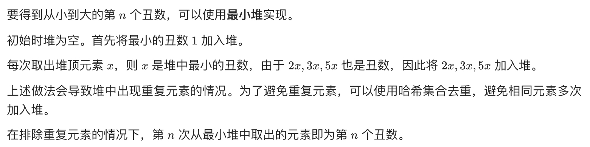
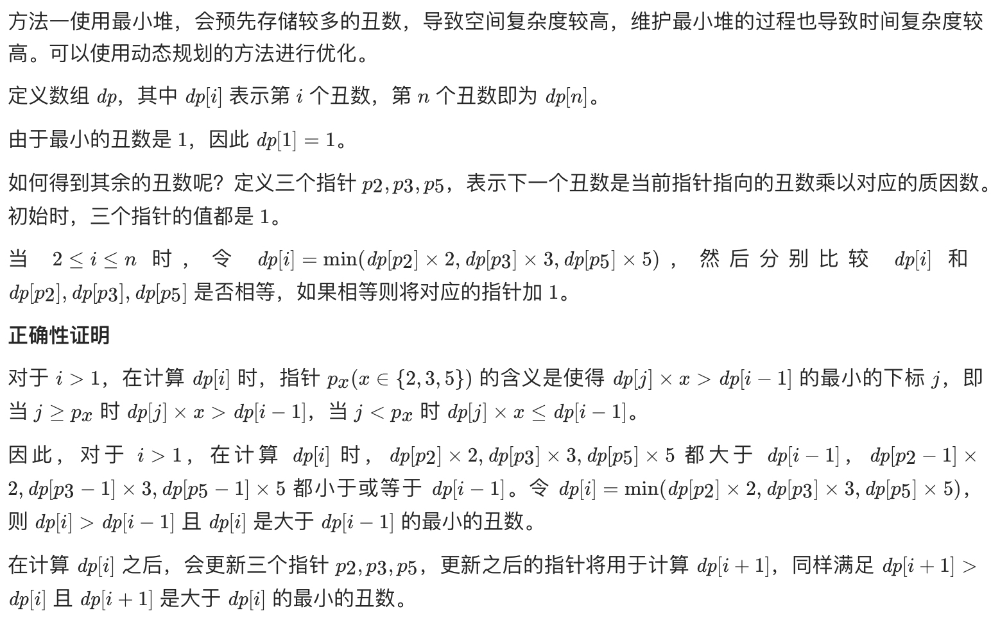

# [剑指 Offer 49. 丑数](https://leetcode-cn.com/problems/chou-shu-lcof/)

## 方法一：小顶堆

## 解题思路



## 复杂度分析

**时间复杂度：O(NlogN)**，得到第 n 个丑数需要进行 n 次循环，每次循环都要从最小堆中取出 1 个元素以及向最小堆中加入最多 3 个元素，因此每次循环的时间复杂度是 O(logn+log3n)=O(logn)，总时间复杂度是 O(nlogn)。

**空间复杂度：O(1)**，空间复杂度主要取决于最小堆和哈希集合的大小，最小堆和哈希集合的大小都不会超过 3n。 

## 代码实现

```golang
type Heap struct { // 自定义构建小顶堆结构
	sort.IntSlice
}

func (h *Heap) Push(v interface{}) {
	h.IntSlice = append(h.IntSlice, v.(int))
}
func (h *Heap) Pop() interface{} {
	a := h.IntSlice
	v := a[len(a)-1]
	h.IntSlice = a[:len(a)-1]
	return v
}

var factors = []int{2, 3, 5}

func nthUglyNumber(n int) int {
	h := new(Heap)
	heap.Init(h)
	seen := make(map[int]bool)
	heap.Push(h, 1)
	seen[1] = true
	var x int
	for i := 0; i < n; i++ {
		x = heap.Pop(h).(int) // 取堆顶元素
		for i := 0; i < len(factors); i++ {
			next := x * factors[i]
			if _, ok := seen[next]; !ok { // 判断是否已经存在于之前的丑数中
				heap.Push(h, next)
				seen[next] = true
			}
		}
	}
	return x
}
```

## 方法二：动态规划

## 解题思路



## 复杂度分析

**时间复杂度：O(N)**

**空间复杂度：O(N)** 

## 代码实现

```golang
func nthUglyNumber(n int) int {
	dp := make([]int, n+1) // 哨兵优化，dp[i]表示第i个丑数
	dp[1] = 1
	// 定义三个指针p2、p3、p5
	// 表示下一个丑数是当前指针指向的丑数乘以对应的质因数
	p2, p3, p5 := 1, 1, 1
	for i := 2; i <= n; i++ {
		// 分别根据质因子计算之后的丑数
		// 根据质因子分别构造一个丑数，比较其中最小的为下一个丑数
		x2, x3, x5 := dp[p2]*2, dp[p3]*3, dp[p5]*5
		dp[i] = min(min(x2, x3), x5)
		if dp[i] == x2 { // p2指向的丑数使用过后，后移
			p2++
		}
		if dp[i] == x3 { // p3指向的丑数使用过后，后移
			p3++
		}
		if dp[i] == x5 { // p5指向的丑数使用过后，后移
			p5++
		}
	}
	return dp[n]
}
```

