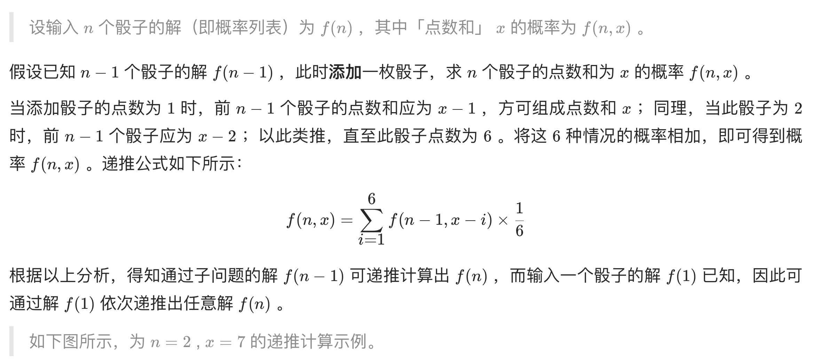
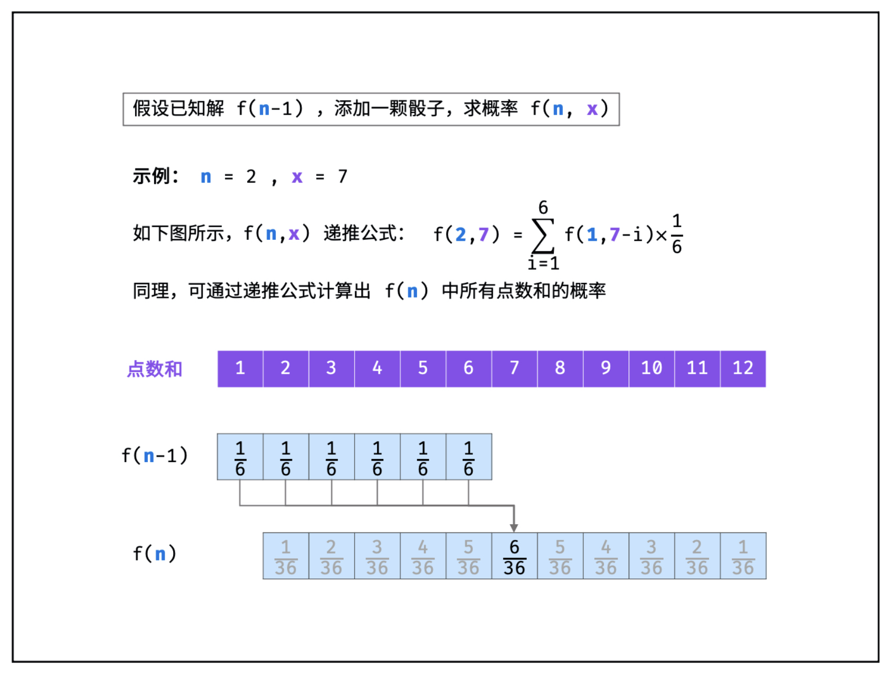
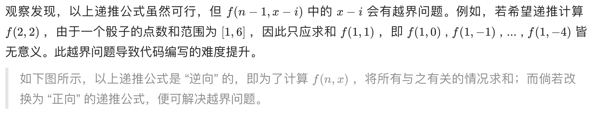
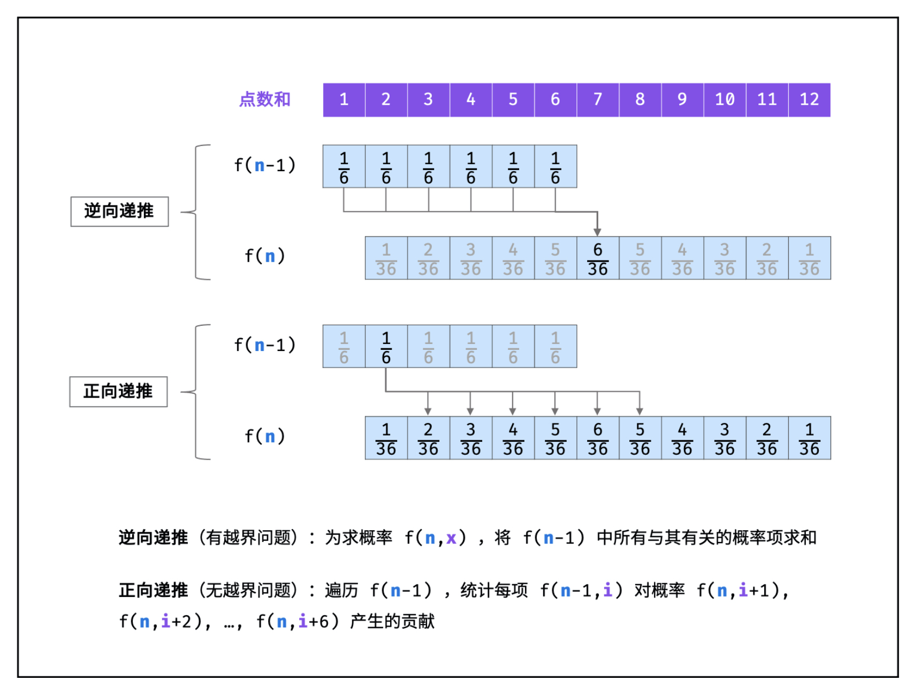
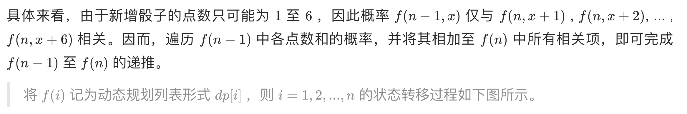

# [剑指 Offer 60. n个骰子的点数](https://leetcode-cn.com/problems/nge-tou-zi-de-dian-shu-lcof/)

## 解题思路











## 复杂度分析

**时间复杂度：O(N^2)**

**空间复杂度：O(N)** 

## 代码实现

```golang
func dicesProbability(n int) []float64 {
	dp := make([]float64, 6)
	for i := range dp { // 初始化
		dp[i] = 1 / 6.0
	}
	for i := 2; i <= n; i++ { // 从2个筛子开始遍历所有筛子
		tmp := make([]float64, 5*i+1)
		for j := 0; j < len(dp); j++ {
			for k := 0; k < 6; k++ {
				tmp[j+k] += dp[j] / 6.0
			}
		}
		dp = tmp
	}
	return dp
}
```