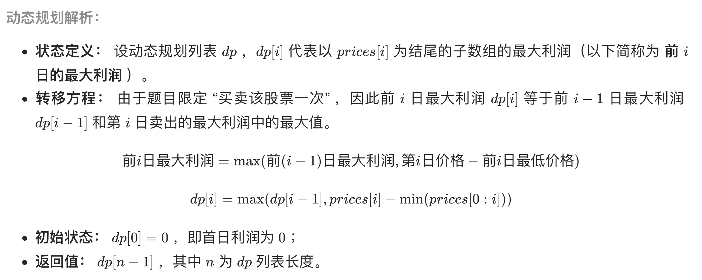
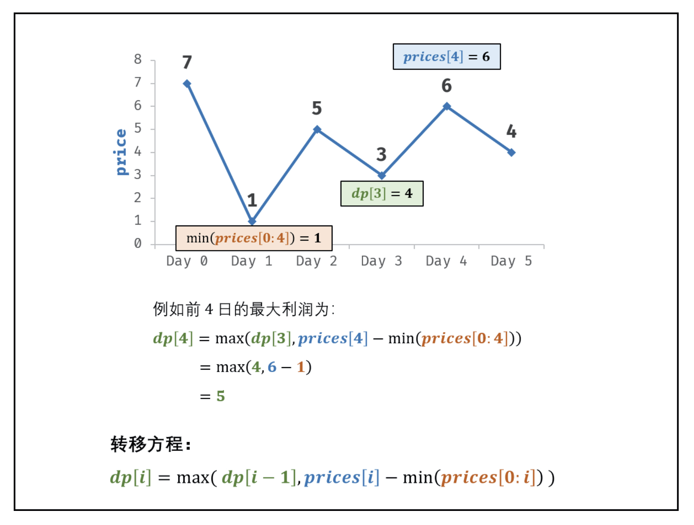
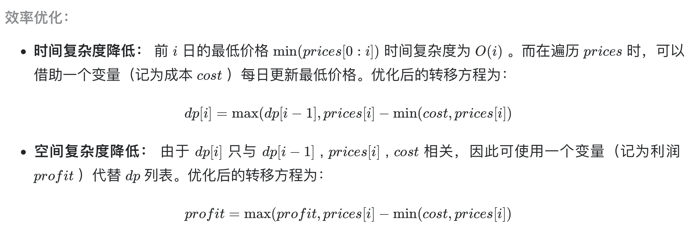

# [剑指 Offer 63. 股票的最大利润](https://leetcode-cn.com/problems/gu-piao-de-zui-da-li-run-lcof/)

## 解题思路







## 复杂度分析

**时间复杂度：O(N)**

**空间复杂度：O(1)** 

## 代码实现

```golang
func maxProfit(prices []int) int {
	if len(prices) == 0 {
		return 0
	}
	minPrice := prices[0] // 记录当前日期以前的最小价格
	profit := 0           // 滚动数组优化，数组长度为1，取代dp[]
	for i := 1; i < len(prices); i++ {
		profit = max(profit, prices[i]-minPrice)
		if prices[i] < minPrice { // 更新最小值
			minPrice = prices[i]
		}
	}
	return profit
}

func max(a, b int) int {
	if a > b {
		return a
	}
	return b
}
```