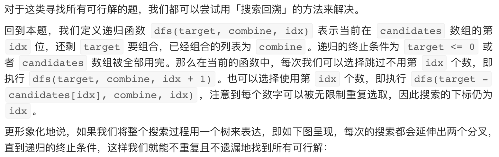
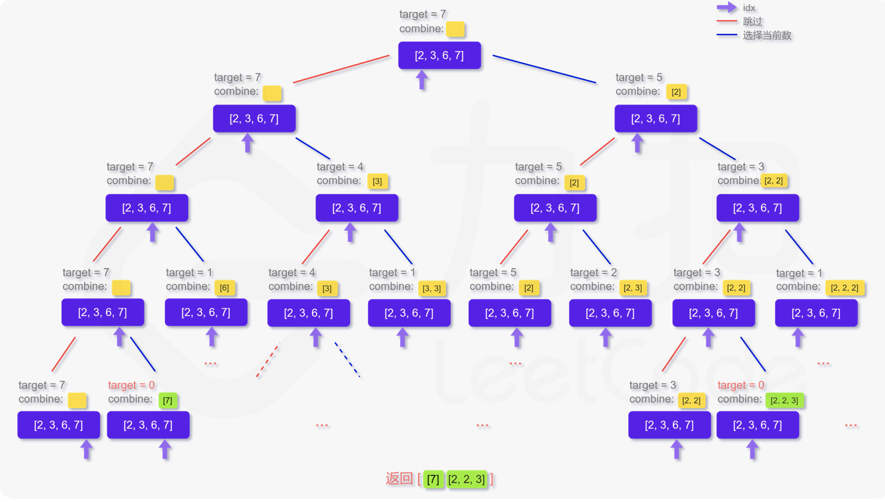

# [39. 组合总和](https://leetcode-cn.com/problems/combination-sum/)

## 解题思路（回溯法+剪枝）





## 复杂度分析

**时间复杂度：O(S)**，其中 S 为所有可行解的长度之和。从分析给出的搜索树我们可以看出时间复杂度取决于搜索树所有叶子节点的深度之和，即所有可行解的长度之和。在这题中，我们很难给出一个比较紧的上界，我们知道 O(n*2^n) 是一个比较松的上界，即在这份代码中，n 个位置每次考虑选或者不选，如果符合条件，就加入答案的时间代价。但是实际运行的时候，因为不可能所有的解都满足条件，**递归的时候我们还会用 target - candidates[idx] >= 0 进行剪枝**，所以实际运行情况是远远小于这个上界的。

**空间复杂度：O(target)**，递归栈。 

## 代码实现

```golang
func combinationSum(candidates []int, target int) [][]int {
	var res [][]int
	var cur []int // 记录当前组合
	var dfs func(sum, index int)
	dfs = func(sum, index int) {
		if index == len(candidates) { // 终止条件
			return
		}
		if sum == target { // 终止条件，记录结果
			// 注意 res 是[][]int，需要深拷贝进去，不能直接复制
			res = append(res, append([]int{}, cur...))
			return
		}
		// 直接跳过，不选择当前数字
		dfs(sum, index+1)
		// 选择当前数字
		if sum+candidates[index] <= target { // 剪枝，判断是否溢出，注意到candidates均为正数
			cur = append(cur, candidates[index])
			dfs(sum+candidates[index], index) // 注意此处是 index，而非 index+1，因为元素可重复
			cur = cur[:len(cur)-1]
		}
	}
	dfs(0, 0)
	return res
}
```

## 相关题目

[322. 零钱兑换](https://github.com/WTongStudio/LeetCode/blob/master/算法/动态规划/322.%20零钱兑换.md)