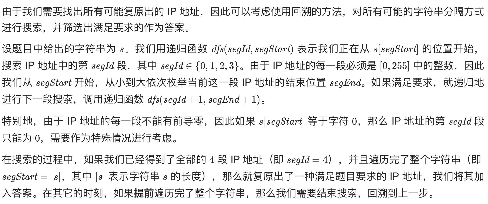

# [93. 复原 IP 地址](https://leetcode-cn.com/problems/restore-ip-addresses/)

## 解题思路



## 复杂度分析

**时间复杂度：O(|s|*3^4)**

**空间复杂度：O(1)** 

## 代码实现

```golang
func restoreIpAddresses(s string) []string {
	var res []string
	segments := make([]int, 4) // 分四段记录数据
	var dfs func(segId, segStart int)
	dfs = func(segId, segStart int) {
		// 如果找到了 4 段 IP 地址并且遍历完了字符串，那么就是一种答案
		if segId == 4 { // segId从0开始，遍历到4说明已经到第5段了
			if segStart == len(s) {
				ipAddr := ""
				for i := 0; i < 4; i++ {
					ipAddr += strconv.Itoa(segments[i]) + "."
				}
				res = append(res, ipAddr[:len(ipAddr)-1]) // 注意去掉末尾的点
			}
			return
		}
		// 如果还没有找到 4 段 IP 地址就已经遍历完了字符串，那么提前回溯
		if segStart == len(s) {
			return
		}
		// 由于不能有前导零，如果当前数字为 0，那么这一段 IP 地址只能为 0
		if s[segStart] == '0' {
			segments[segId] = 0
			dfs(segId+1, segStart+1)
			return // 注意此处需要返回，否则会继续执行
		}
		// 一般情况，枚举每一种可能性并递归
		addr := 0
		for segEnd := segStart; segEnd < len(s); segEnd++ {
			addr = addr*10 + int(s[segEnd]-'0')
			if addr >= 0 && addr <= 0xFF {
				segments[segId] = addr
				dfs(segId+1, segEnd+1)
			} else {
				break
			}
		}
	}
	dfs(0, 0)
	return res
}
```