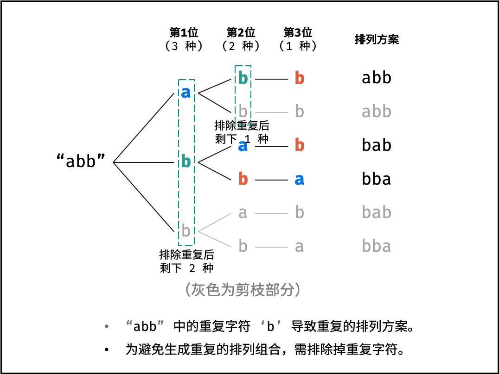
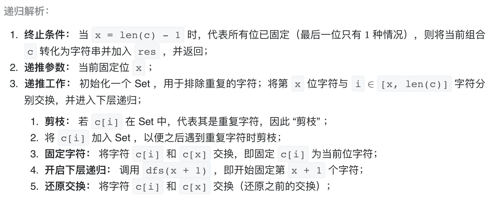

# [剑指 Offer 38. 字符串的排列](https://leetcode-cn.com/problems/zi-fu-chuan-de-pai-lie-lcof/)

## 解题思路

对于一个长度为 n 的字符串（假设字符互不重复），其排列方案数共有：n×(n−1)×(n−2)…×2×1。

根据字符串排列的特点，考虑深度优先搜索所有排列方案。即通过字符交换，先固定第 1 位字符（ n 种情况）、再固定第 2 位字符（ n−1 种情况）、... 、最后固定第 n 位字符（1 种情况）。**核心思路：通过字符交换，将某一字符交换到固定位置，从而保证未遍历到的字符均还未使用过**。


**当字符串存在重复字符时，排列方案中也存在重复的排列方案**。为排除重复方案，需在固定某位字符时，**保证 “每种字符只在此位固定一次” ，即遇到重复字符时不交换，直接跳过**。从 DFS 角度看，此操作称为 **“剪枝”** 。





## 复杂度分析

**时间复杂度：O(NlogK)**

**空间复杂度：O(1)** 

## 代码实现

```golang
func permutation(s string) []string {
	var res []string
	n := len(s)
	var dfs func(c []byte, i int)
	dfs = func(c []byte, i int) {
		if i == n-1 { // 终止条件
			res = append(res, string(c)) // 添加排列方案到结果集
		}
		set := make(map[byte]bool) // 需要排重，重复元素交换无意义，只需针对本层遍历排重即可
		for j := i; j < n; j++ {
			if set[c[j]] { // 重复字符，剪枝
				continue
			}
			set[c[j]] = true
			c[j], c[i] = c[i], c[j] // 交换，将 c[j] 固定在第 i 位
			dfs(c, i+1)             // 开始固定第 i+1 位字符
			c[j], c[i] = c[i], c[j] // 恢复交换
		}
	}
	dfs([]byte(s), 0)
	return res
}
```