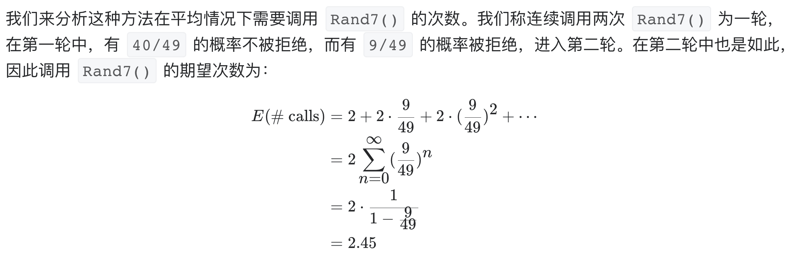

# [470. 用 Rand7() 实现 Rand10()](https://leetcode-cn.com/problems/implement-rand10-using-rand7/)

## 解题思路





## 复杂度分析

**时间复杂度：O(1)**

**空间复杂度：O(1)** 

## 代码实现

```golang
func rand10() int {
	// 首先得到一个数
	num := (rand7()-1)*7 + rand7()
	for num > 40 {
		num = (rand7()-1)*7 + rand7()
	}
	// 返回结果，+1是为了解决 40%10为0的情况
	return 1 + num%10
}
```