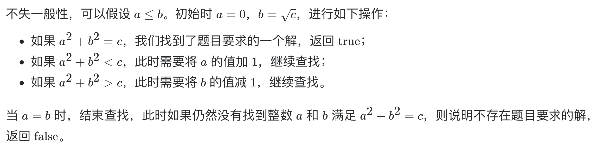

# [633. 平方数之和](https://leetcode-cn.com/problems/sum-of-square-numbers/)

## 解题思路（双指针）



## 复杂度分析

**时间复杂度：O(sqrt(c))**

**空间复杂度：O(1)** 

## 代码实现

```golang
func judgeSquareSum(c int) bool {
	a, b := 0, int(math.Sqrt(float64(c))) // 开方后向下取整
	for a <= b {
		sum := a*a + b*b
		if sum == c {
			return true
		} else if sum > c {
			b--
		} else {
			a++
		}
	}
	return false
}
```