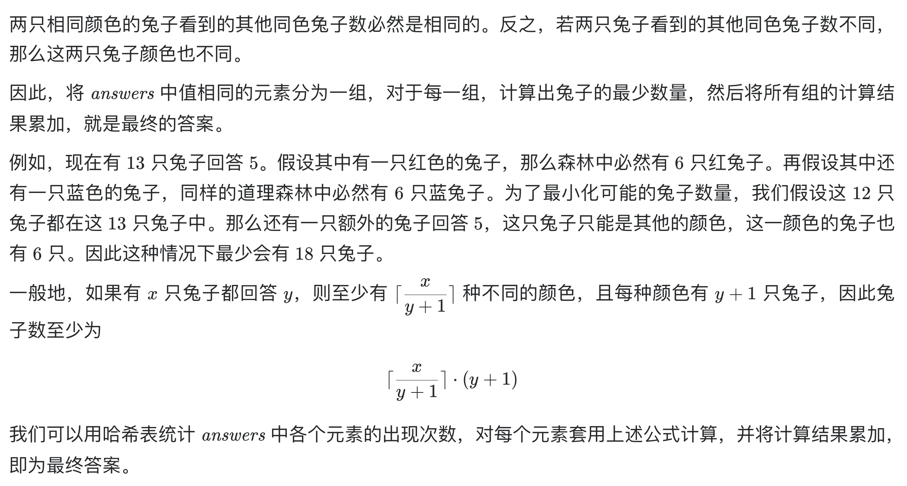

# [781. 森林中的兔子](https://leetcode-cn.com/problems/rabbits-in-forest/)

## 解题思路



## 复杂度分析

**时间复杂度：O(N)**

**空间复杂度：O(N)** 

## 代码实现

```golang
func numRabbits(answers []int) (ans int) {
	count := map[int]int{}
	for _, y := range answers { // 统计相同答案的兔子个数
		count[y]++
	}
	for y, x := range count {
		if x%(y+1) == 0 {
			ans += x / (y + 1) * (y + 1)
		} else { // 注意向上取整
			ans += (x/(y+1) + 1) * (y + 1)
		}
	}
	return
}
```