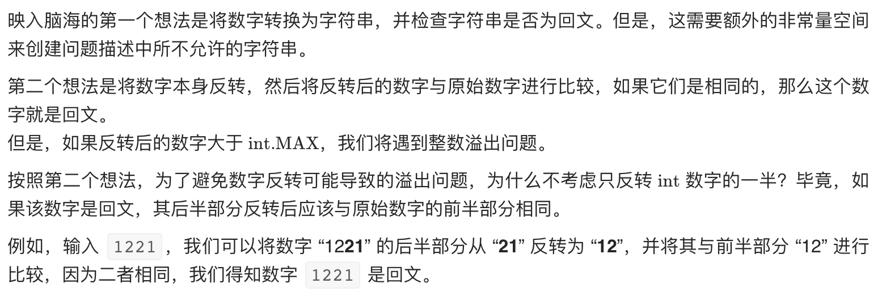
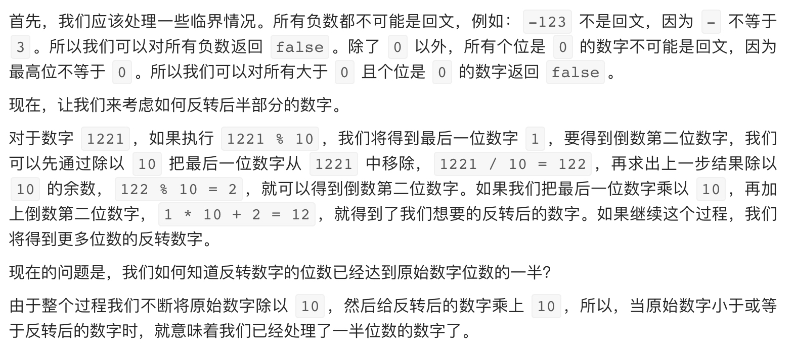

# [9. 回文数](https://leetcode-cn.com/problems/palindrome-number/)

## 解题思路






## 复杂度分析

**时间复杂度：O(logN)**

**空间复杂度：O(1)** 

## 代码实现

```golang
func isPalindrome(x int) bool {
	if x < 0 || (x != 0 && x%10 == 0) { // 特判
		// 1、负数不可能是回文数
		// 2、非零数字的最后一位是 0 时，不可能是回文数，
		return false
	}

	reNum := 0      // 记录翻转后的数字
	for x > reNum { // 翻转后半段数字，注意终止条件
		reNum = reNum*10 + x%10
		x /= 10
	}

	// 当数字长度为奇数时，我们可以通过 reNum/10 去除处于中位的数字。
	// 由于处于中位的数字不影响回文（它总是与自己相等），所以我们可以简单地将其去除。
	return x == reNum || x == reNum/10
}
```