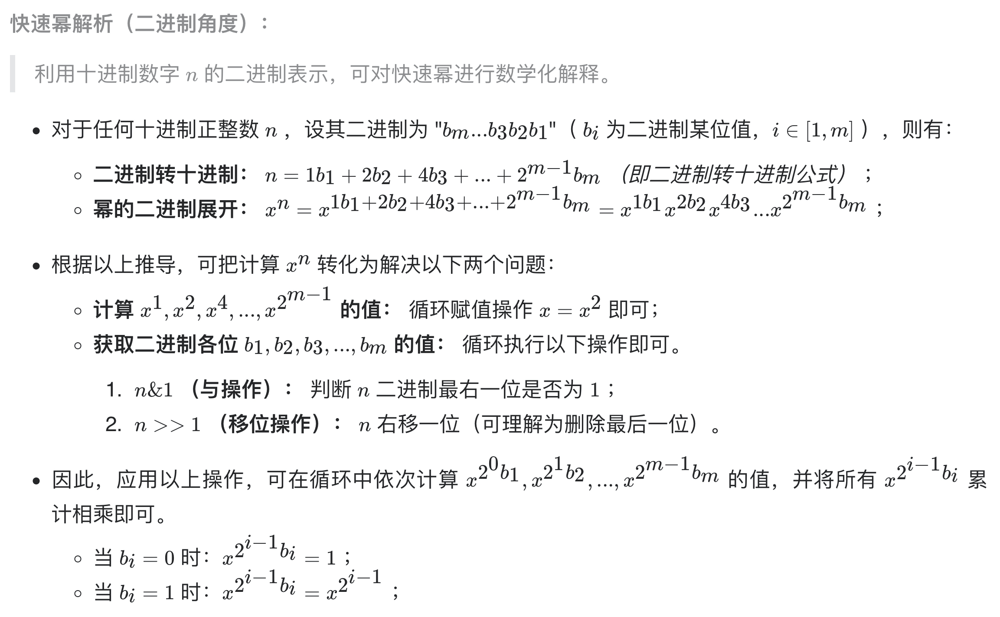
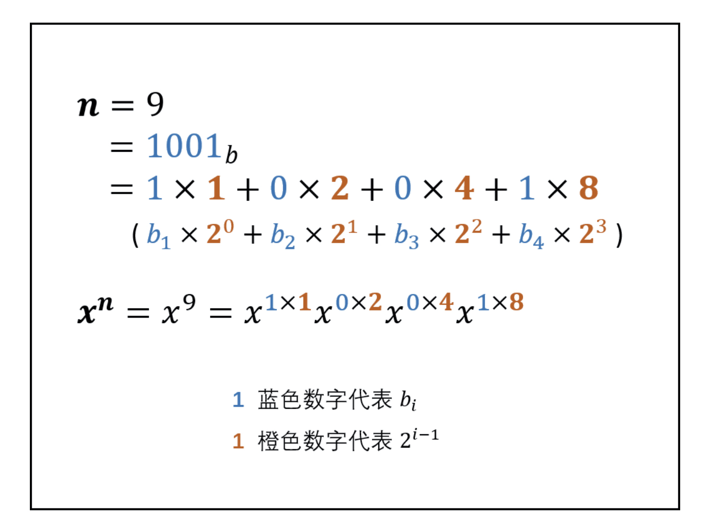

# [剑指 Offer 16. 数值的整数次方](https://leetcode-cn.com/problems/shu-zhi-de-zheng-shu-ci-fang-lcof/)

## 解题思路

注意细节，边界判断，负数处理等。





## 复杂度分析

**时间复杂度：O(logN)**

**空间复杂度：O(1)** 

## 代码实现

```golang
func myPow(x float64, n int) float64 {
	if x == 0 { // 注意特判
		return 0
	}
	if n < 0 { // 注意细节，处理负数情况
		x, n = 1/x, -n
	}
	res := 1.0
	for n != 0 {
		if n&1 == 1 { // 最后一位为1
			res *= x
		}
		x = x * x // 构造x^(2^m-1)
		n = n >> 1
	}
	return res
}
```