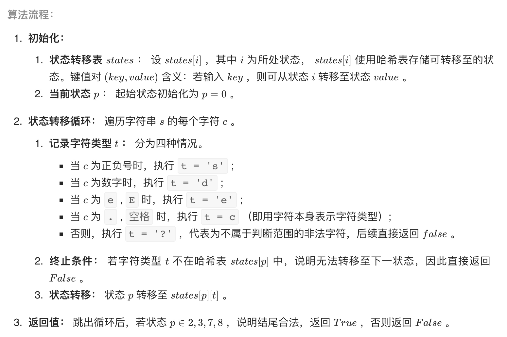

# [剑指 Offer 20. 表示数值的字符串](https://leetcode-cn.com/problems/biao-shi-shu-zhi-de-zi-fu-chuan-lcof/)

## 解题思路

本题使用有限状态自动机，根据字符类型和合法数值的特点，先定义状态，再画出状态转移图，最后编码实现。

**字符类型**：空格 「 」、数字「 0—9 」 、正负号 「 +− 」 、小数点 「 . 」 、幂符号 「 eE 」 。

**状态定义**：

- 0：开始的空格
- 1：幂符号前的正负号
- 2：小数点前的数字
- 3：小数点、小数点后的数字
- 4：当小数点前为空格时，小数点、小数点后的数字
- 5：幂符号
- 6：幂符号后的正负号
- 7：幂符号后的数字
- 8：结尾的空格

**结束状态**：

合法的结束状态有 2, 3, 7, 8 。




## 复杂度分析

**时间复杂度：O(N)**，其中 N 为字符串 s 的长度，判断需遍历字符串，每轮状态转移的使用 O(1) 时间。

**空间复杂度：O(1)** ，states 和 p 使用常数大小的额外空间。

## 代码实现

```golang
func isNumber(s string) bool {
	states := make([]map[byte]int, 9)
	for i := range states {
		states[i] = make(map[byte]int)
	}
	// 开始的空格
	states[0][' '] = 0
	states[0]['s'] = 1
	states[0]['d'] = 2
	states[0]['.'] = 4
	// 幂符号前的正负号
	states[1]['d'] = 2
	states[1]['.'] = 4
	// 小数点前的数字
	states[2]['d'] = 2
	states[2]['.'] = 3
	states[2]['e'] = 5
	states[2][' '] = 8
	// 小数点、小数点后的数字
	states[3]['d'] = 3
	states[3]['e'] = 5
	states[3][' '] = 8
	// 当小数点前为空格时，小数点、小数点后的数字
	states[4]['d'] = 3
	// 幂符号
	states[5]['s'] = 6
	states[5]['d'] = 7
	// 幂符号后的正负号
	states[6]['d'] = 7
	// 幂符号后的数字
	states[7]['d'] = 7
	states[7][' '] = 8
	// 结尾的空格
	states[8][' '] = 8

	var t byte
	p := 0
	for _, c := range s {
		if '0' <= c && c <= '9' { // 数字
			t = 'd'
		} else if c == '+' || c == '-' { // 正负号
			t = 's'
		} else if c == 'e' || c == 'E' { // 幂符号
			t = 'e'
		} else if c == '.' || c == ' ' { // 点
			t = byte(c)
		} else { // 未知
			t = '?'
		}
		if _, ok := states[p][t]; !ok {
			return false
		}
		p = states[p][t]
	}
	if p == 2 || p == 3 || p == 7 || p == 8 {
		return true
	}
	return false
}
```