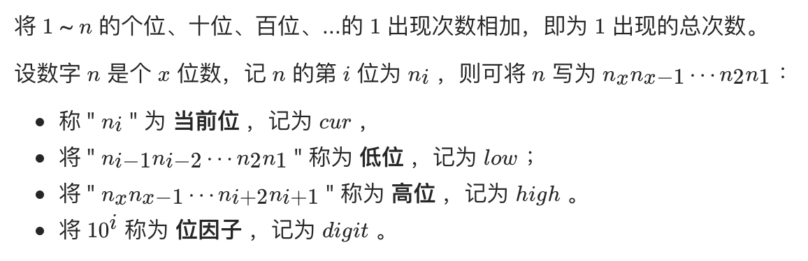
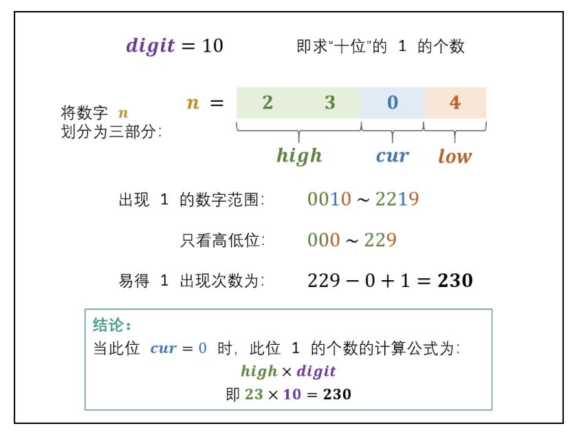
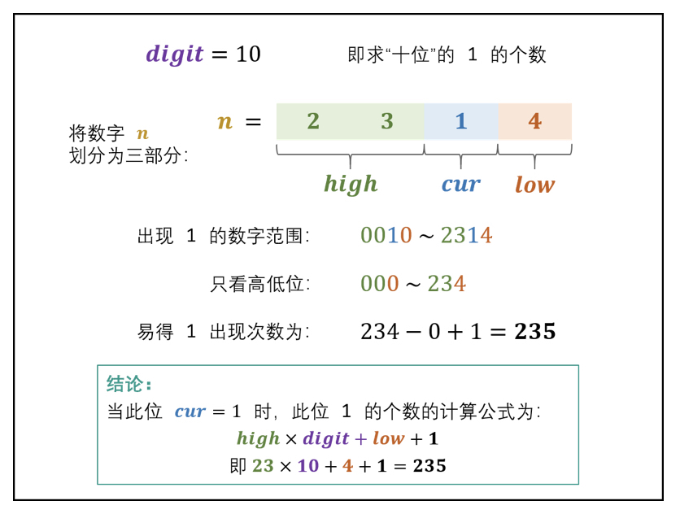

# [剑指 Offer 43. 1～n 整数中 1 出现的次数](https://leetcode-cn.com/problems/1nzheng-shu-zhong-1chu-xian-de-ci-shu-lcof/)

## 解题思路



某位中 1 出现次数的计算方法，根据当前位 cur 值的不同，分为以下**三种情况**：

**① 当 cur=0 时：** 此位 1 的出现次数只由高位 high 决定，计算公式为：**high x digit**



 **② 当 cur=1 时：** 此位 1 的出现次数由高位 high 和低位 low 决定，计算公式为：**high x digit + low + 1**



**③ 当 cur=2,3,⋯,9 时**： 此位 1 的出现次数只由高位 high 决定，计算公式为：**(high+1) x digit**


## 复杂度分析

**时间复杂度：O(logN)**， 循环内的计算操作使用 O(1) 时间；循环次数为数字 n 的位数，即  log10^n ，因此循环使用 O(logn) 时间。

**空间复杂度：O(1)** 

## 代码实现

```golang
func countDigitOne(n int) int {
	// 这里 digitNum 为 digit 所在位 对应的可能性
	// 其实位为个位 因此 digitNum = 1  1乘以任何数 = 任何数
	digitNum, sum := 1, 0
	high, cur, low := n/10, n%10, 0
	for high != 0 || cur != 0 {
		// 固定位 计算数量
		if cur < 1 {
			sum += high * digitNum
		} else if cur == 1 {
			sum += high*digitNum + low + 1
		} else {
			sum += (high + 1) * digitNum
		}
		// 换下一位 更新高低位 及digit数量级
		low = low + cur*digitNum
		high, cur = high/10, high%10
		digitNum = digitNum * 10
	}
	return sum
}
```