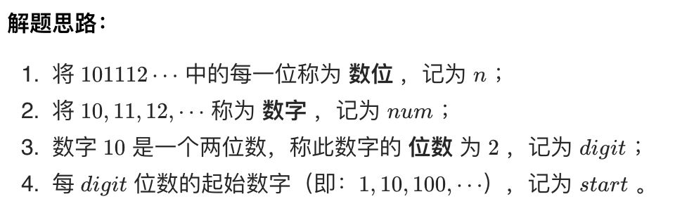
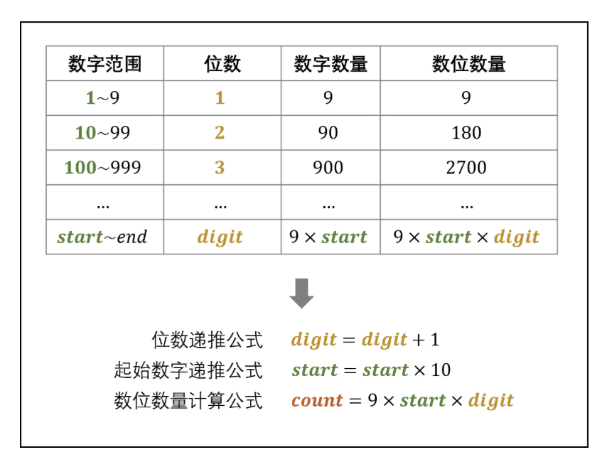
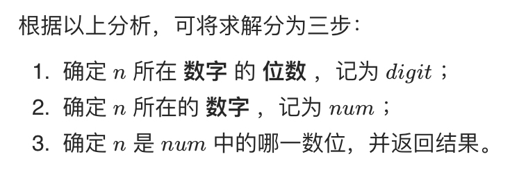
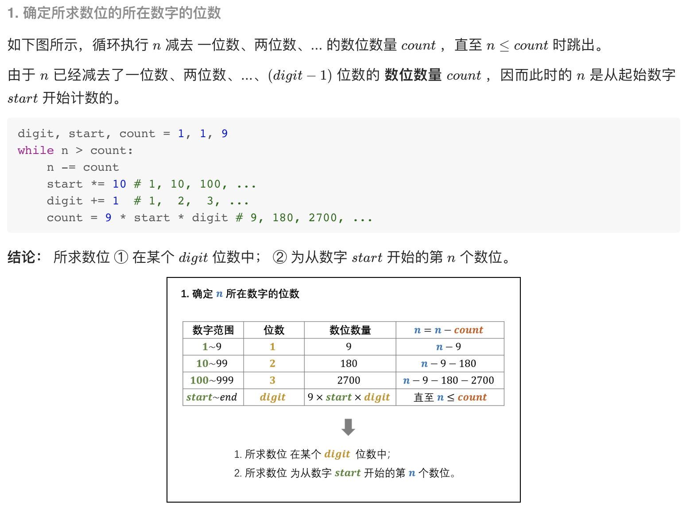
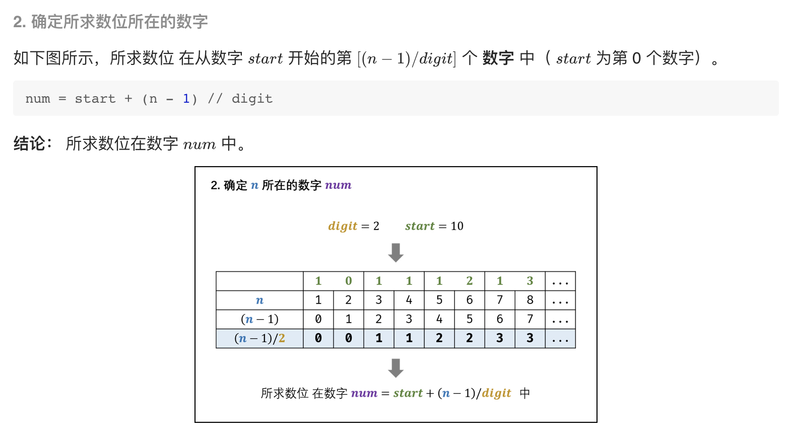
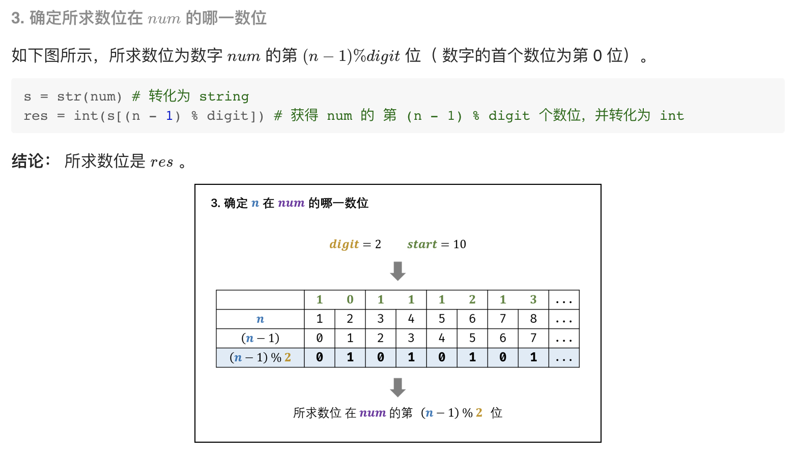

# [剑指 Offer 44. 数字序列中某一位的数字](https://leetcode-cn.com/problems/shu-zi-xu-lie-zhong-mou-yi-wei-de-shu-zi-lcof/)

## 解题思路





观察上表，可推出各 digit 下的数位数量 count 的计算公式：**count = 9 x start x digit**









## 复杂度分析

**时间复杂度：O(logN)**，所求数位 n 对应数字 num 的位数 digit 最大为 O(logn) ；第一步最多循环 O(logn) 次；第三步中将 num 转化为字符串使用 O(logn) 时间；因此总体为 O(logn) 。

**空间复杂度：O(logN)**，将数字 num 转化为字符串 str(num) ，占用 O(log⁡n) 的额外空间。 

## 代码实现

```golang
func findNthDigit(n int) int {
	digit, start, count := 1, 1, 9
	// 1、确定所求数位的所在数字的位数
	for n > count {
		n -= count
		start *= 10 // 1、10、100...
		digit += 1  // 1、2、3
		count = 9 * start * digit
	}
	// 2、确定所求数位所在的数字
	num := start + (n-1)/digit
	// 3、确定所求数位在 num 的哪一数位
	s := strconv.Itoa(num)           // 转化为 string
	res := int(s[(n-1)%digit] - '0') // 获得 num 的 第 (n - 1) % digit 个数位，并转化为 int
	return res
}
```