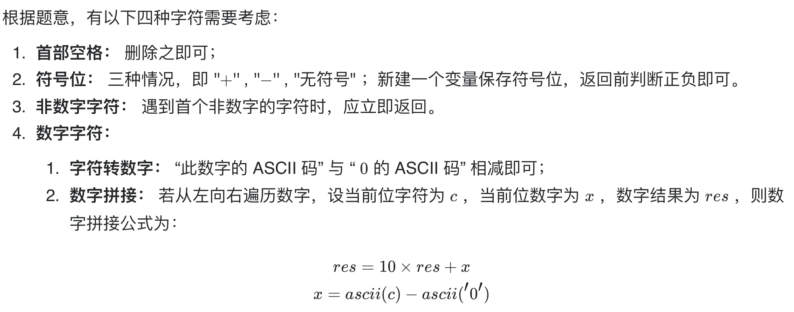
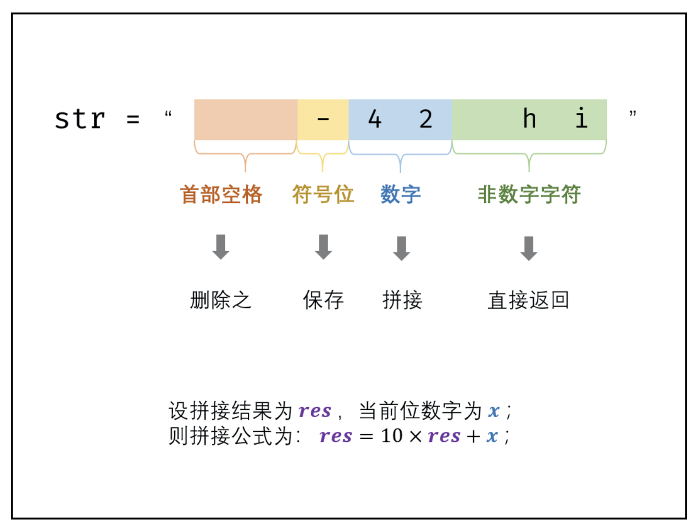
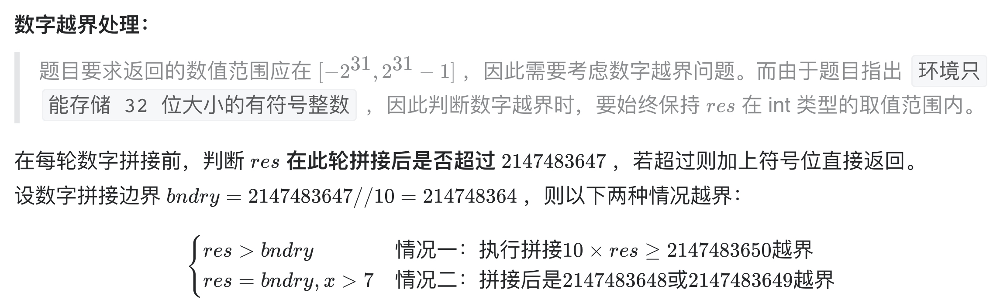
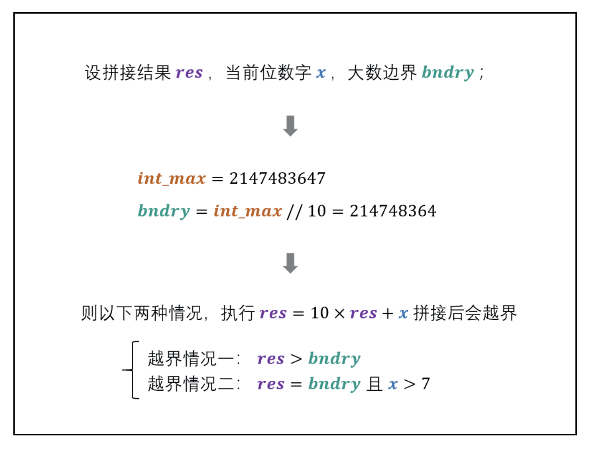

# [剑指 Offer 67. 把字符串转换成整数](https://leetcode-cn.com/problems/ba-zi-fu-chuan-zhuan-huan-cheng-zheng-shu-lcof/)

## 解题思路









## 复杂度分析

**时间复杂度：O(N)**

**空间复杂度：O(N)**，删除首尾空格后需建立新字符串，最差情况下占用 O(N) 额外空间。 

## 代码实现

```golang
func strToInt(str string) int {
	str = strings.Trim(str, " ") // 删除首尾空格
	if str == "" {
		return 0
	}
	res, i, sign := 0, 0, 1
	bndry := math.MaxInt32 / 10 // 大数边界
	if str[0] == '-' {
		sign = -1
		i++ // 若有符号，则需从 i=1 开拼接数字
	} else if str[0] == '+' {
		sign = 1
		i++
	}
	for j := i; j < len(str); j++ {
		if !(str[j] >= '0' && str[j] <= '9') { // 遇到非数字的字符则跳出
			break
		}
		if res > bndry || res == bndry && str[j] > '7' { // 数字越界处理
			if sign == 1 {
				return math.MaxInt32
			}
			return math.MinInt32
		}
		res = 10*res + int(str[j]-'0') // 数字拼接
	}
	return sign * res
}
```