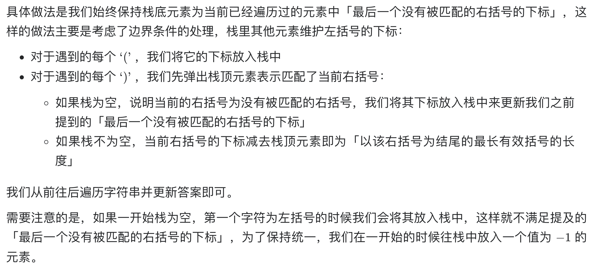
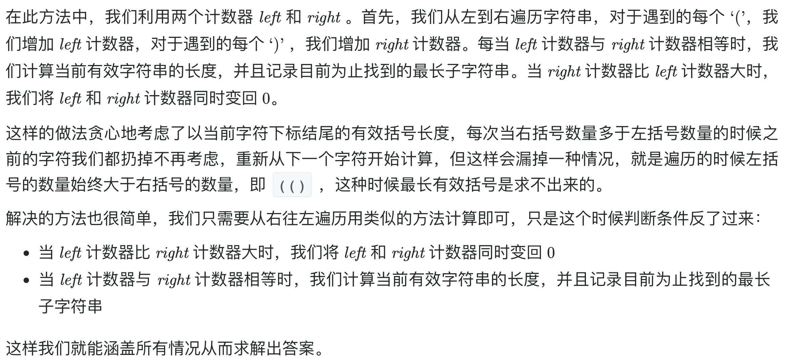

# [32. 最长有效括号](https://leetcode-cn.com/problems/longest-valid-parentheses/)

## 方法一：栈

## 解题思路

通过栈，我们可以在遍历给定字符串的过程中去判断到目前为止扫描的子串的有效性，同时能得到最长有效括号的长度。



**解释：栈底保持“最后一个没有被匹配的有括号下标”或-1，都是为了方便计算当前最长有效括号长度**。

## 复杂度分析

**时间复杂度：O(N)**

**空间复杂度：O(N)** 

## 代码实现

```golang
func longestValidParentheses(s string) int {
	maxLen := 0
	stack := make([]int, 0)
	stack = append(stack, -1) // 哨兵优化，保持逻辑的一致性，防止第一个括号是右括号
	for i := 0; i < len(s); i++ {
		if s[i] == '(' {
			stack = append(stack, i)
		} else {
			stack = stack[:len(stack)-1] // 出栈，相互抵消
			if len(stack) == 0 {         // 栈为空，则更新栈底元素为最后一个右括号的下标
				stack = append(stack, i)
			} else {
				// 如果栈不为空，当前右括号的下标减去栈顶元素即为「以该右括号为结尾的最长有效括号的长度」
				maxLen = max(maxLen, i-stack[len(stack)-1])
			}
		}
	}
	return maxLen
}

func max(x, y int) int {
	if x > y {
		return x
	}
	return y
}
```

## 方法二：贪心算法（推荐）

## 解题思路



## 复杂度分析

**时间复杂度：O(N)**

**空间复杂度：O(1)** 

## 代码实现

```golang
func longestValidParentheses(s string) int {
	left, right, maxLength := 0, 0, 0
	// 1、先从左往右遍历
	for i := 0; i < len(s); i++ {
		if s[i] == '(' {
			left++
		} else {
			right++
		}
		if left == right {
			maxLength = max(maxLength, 2*right)
		} else if right > left { // 归零处理
			left, right = 0, 0
		}
	}
	left, right = 0, 0
	// 2、再从右往左遍历，防止遗漏特例情况：(()
	for i := len(s) - 1; i >= 0; i-- {
		if s[i] == '(' {
			left++
		} else {
			right++
		}
		if left == right {
			maxLength = max(maxLength, 2*left)
		} else if left > right { // 归零处理，注意判断条件是反过来的
			left, right = 0, 0
		}
	}
	return maxLength
}

func max(x, y int) int {
	if x > y {
		return x
	}
	return y
}
```

