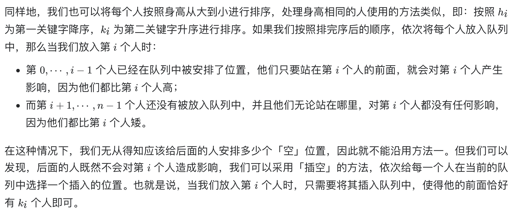

# [406. 根据身高重建队列](https://leetcode-cn.com/problems/queue-reconstruction-by-height/)

## 解题思路



## 复杂度分析

**时间复杂度：O(N^2)**

**空间复杂度：O(logN)** 

## 代码实现

```golang
func reconstructQueue(people [][]int) (ans [][]int) {
	sort.Slice(people, func(i, j int) bool { // 排序
		a, b := people[i], people[j]
		return a[0] > b[0] || a[0] == b[0] && a[1] < b[1]
	})
	for _, person := range people { // 将每个人插入对应位置
		idx := person[1]
		ans = append(ans[:idx], append([][]int{person}, ans[idx:]...)...)
	}
	return
}
```